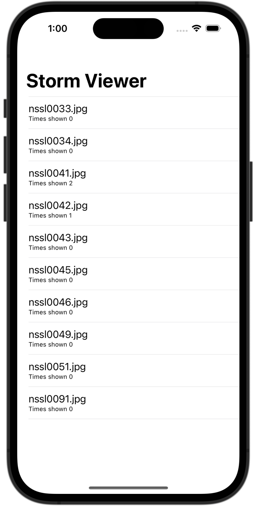
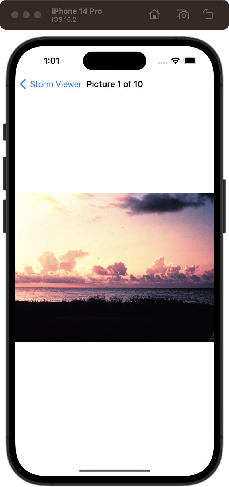

# Storm Viewer

[Project 1](https://www.hackingwithswift.com/read/1/overview) from the [100 Days of Swift course](https://www.hackingwithswift.com/100) by [Hacking With Swift](https://www.hackingwithswift.com/).

## Contents

|                      Day                      | Contents                                                                                                                                                                                                                                                                                                                                                                    |
|:---------------------------------------------:|:----------------------------------------------------------------------------------------------------------------------------------------------------------------------------------------------------------------------------------------------------------------------------------------------------------------------------------------------------------------------------|
| [16](https://www.hackingwithswift.com/100/16) | <ul><li>[Setting up](https://www.hackingwithswift.com/read/1/1/setting-up)</li><li>[Listing images with FileManager](https://www.hackingwithswift.com/read/1/2/listing-images-with-filemanager)</li><li>[Designing our interface](https://www.hackingwithswift.com/read/1/3/designing-our-interface)</li></ul>                                                              |
| [17](https://www.hackingwithswift.com/100/17) | <ul><li>[Building a detail screen](https://www.hackingwithswift.com/read/1/4/building-a-detail-screen)</li><li>[Loading images with UIImage](https://www.hackingwithswift.com/read/1/5/loading-images-with-uiimage)</li><li>[Final tweaks: hidesBarsOnTap, safe area margins](https://www.hackingwithswift.com/read/1/6/final-tweaks-hidesbarsontap-safe-area-margins)</li> | 
| [18](https://www.hackingwithswift.com/100/18) | <ul><li>[Wrap up](https://www.hackingwithswift.com/read/1/6/wrap-up)</li><li>[Review for Project 1: Storm Viewer](https://www.hackingwithswift.com/review/hws/project-1-storm-viewer)</li>                                                                                                                                                                                  |

## I Have Learnt...

- `FileManager`
- Typecasting (using the "as" keyword, same as Kotlin).
- `UIViewController`: Manages and coordinates the view hierarchy of an app
- **Storyboards**: Visual representation of an app's user interface. It allows developers to create and manage multiple screens, or view controllers, in a single file, making it easier to design and maintain complex interfaces.
- **Outlets**: Property that is annotated with the symbol IBOutlet and whose value you can set graphically in a .nib/.xib file or a storyboard. @IBOutlet has no special meaning other than "this is connected to something in Interface Builder".
- **AutoLayout**: Allows developers to create user interfaces that can adapt to different screen sizes and orientations. It is a system for defining constraints that determine the position and size of user interface elements, such as views and controls, relative to other elements and the screen.
- `UIImageView`: A view for displaying images.
- `UINavigationBar`: The equivalent of ActionBar in Android.
- `UINavigationController`: Manages a stack of view controllers that can be pushed by us. This view controller stack is what gives us the smooth sliding in and out animation.
- The use of `try!` to avoid catching the exception in case that we are completely sure that it won't trigger an exception.

## Challenges

Taken from [here](https://www.hackingwithswift.com/read/1/7/wrap-up):

>- [x] Use Interface Builder to select the text label inside your table view and adjust its size to something larger
>- [x] In your main table view, show the image names in sorted order, so "nssl0033.jpg" comes before "nssl0034.jpg".
>- [x] Rather than show image names in the detail title bar, show "Picture X of Y", where Y is the total number of images and X is the picture's position in the array.
>- [x] ([Day 22](https://www.hackingwithswift.com/read/3/3/wrap-up)) Go back to project 1 and add a bar button item to the main view controller that recommends the app to other people.
>- [x] ([Day 40](https://www.hackingwithswift.com/read/9/6/wrap-up)) Modify project 1 so that loading the list of NSSL images from our bundle happens in the background. Make sure you call reloadData() on the table view once loading has finished!
>- [ ] ([Day 44](https://www.hackingwithswift.com/read/10/7/wrap-up)) Modify project 1 so that it uses a collection view controller rather than a table view controller. I recommend you keep a copy of your original table view controller code so you can refer back to it later on.
>- [x] ([Day 49](https://www.hackingwithswift.com/read/12/5/wrap-up)) Modify project 1 so that it remembers how many times each storm image was shown – you don’t need to show it anywhere, but you’re welcome to try modifying your original copy of project 1 to show the view count as a subtitle below each image name in the table view.

## Screenshots

  
  

