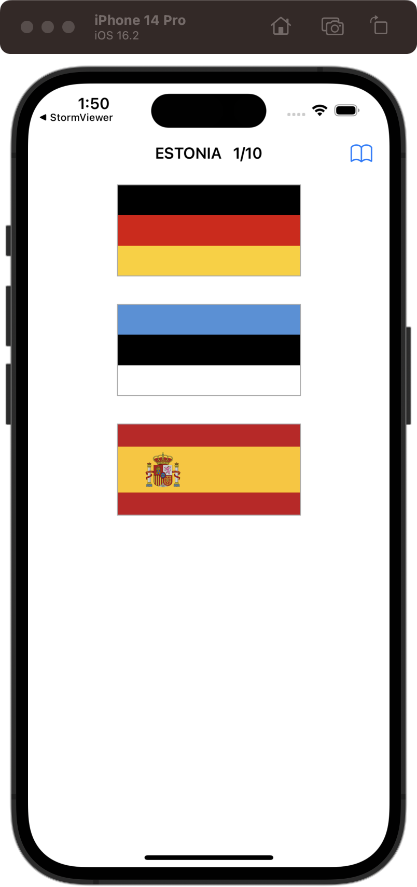
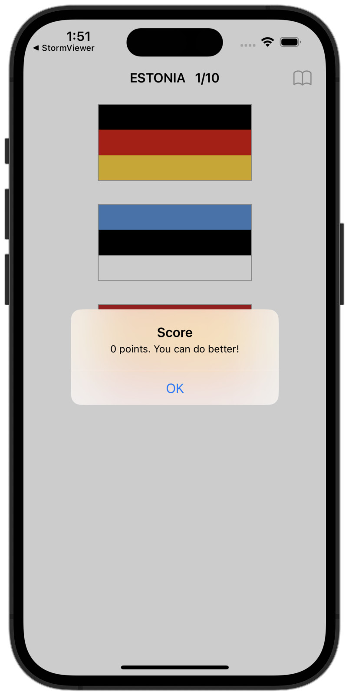

# Guess The Flag

[Project 2](https://www.hackingwithswift.com/read/2/overview) from the [100 Days of Swift course](https://www.hackingwithswift.com/100) by [Hacking With Swift](https://www.hackingwithswift.com/). 

## Contents

| Day                                           | Contents                                                                                                                                                                                                                                                                                                                                    |
|-----------------------------------------------|---------------------------------------------------------------------------------------------------------------------------------------------------------------------------------------------------------------------------------------------------------------------------------------------------------------------------------------------|
| [19](https://www.hackingwithswift.com/100/19) | <ul><li>[Setting up](https://www.hackingwithswift.com/read/2/1/setting-up)</li><li>[Designing your layout](https://www.hackingwithswift.com/read/2/2/designing-your-layout)</li><li>[Making the basic game work: UIButton and CALayer](https://www.hackingwithswift.com/read/2/3/making-the-basic-game-work-uibutton-and-calayer)</li></ul> |
| [20](https://www.hackingwithswift.com/100/20) | <ul><li>[Guess which flag: random numbers](https://www.hackingwithswift.com/read/2/4/guess-which-flag-random-numbers)</li><li>[From outlets to actions: creating an IBAction](https://www.hackingwithswift.com/read/2/5/from-outlets-to-actions-creating-an-ibaction)</li>                                                                  | 
| [21](https://www.hackingwithswift.com/100/21) | <ul><li>[Wrap up](https://www.hackingwithswift.com/read/2/6/wrap-up)</li><li>[Review for Project 2: Guess the Flag](https://www.hackingwithswift.com/review/hws/project-2-guess-the-flag)</li>                                                                                                                                              |

## I Have Learnt...

- The differences between @2x (the points unit are multiplied by 2 on retina screens) and @3x (the points unit are multiplied by 3 on HD retina screens)
- `Assets.xcassets`: The way to organize and manage app resources, such as images, icons, and sound files. To add files to it, simply drop the files into the `Assets.xcassets` folder.
- Handling of `UIButton` with `@IBAction` using Storyboards.
- `CALayer` draws and animates graphical content on the screen. It is a lightweight, hardware-accelerated layer that is responsible for rendering and compositing images, shapes, and other visual elements. It sits below all our UI views as it is part of UIKit.
- `UIColor`: For example, we can't put `UIColor.lightGray` property directly into our border color property because it belongs to `CALayer`, which doesn't know where UI color is. That's why we convert it into a `cgColor`.
- Randomize in Swift with `shuffle()` for arrays and `random(in:)` for `Int`.
- `UIAlertController`: The same as `AlertDialog` in Android.
- `UIAction`: A button that we add to the `UIAlertController`. Same as positive/negative buttons in `AlertDialog`.

## Challenges

Taken from [here](https://www.hackingwithswift.com/read/2/6/wrap-up):

>- [x] Try showing the player's score in the navigation bar, alongside the flag to guess.
>- [x] Keep track of how many questions have been asked, and show one final alert after they have answered 10.
>- [x] When someone chooses the wrong flag, tell them their mistake in your alert.
>- [x] ([Day 22](https://www.hackingwithswift.com/read/3/3/wrap-up)) Go back to project 2 and add a bar button item that shows their score when tapped. 
>- [x] ([Day 49](https://www.hackingwithswift.com/read/12/5/wrap-up)) Modify project 2 so that it saves the player’s highest score, and shows a special message if their new score beat the previous high score.
>- [ ] ([Day 58](https://www.hackingwithswift.com/read/15/5/wrap-up)) Go back to project 2 and make the flags scale down with a little bounce when pressed.
>- [x] ([Day 73](https://www.hackingwithswift.com/read/21/4/wrap-up)) And for an even harder challenge, update project 2 so that it reminds players to come back and play every day. This means scheduling a week of notifications ahead of time, each of which launch the app. When the app is finally launched, make sure you call removeAllPendingNotificationRequests() to clear any un-shown alerts, then make new alerts for future days.

## To Do as a Personal Challenge...

- [ ] Add more flags
- [ ] Stylize the layout
- [ ] Add more features (such as a timer and an option to modify the score goal) 

## Screenshots

  
  

