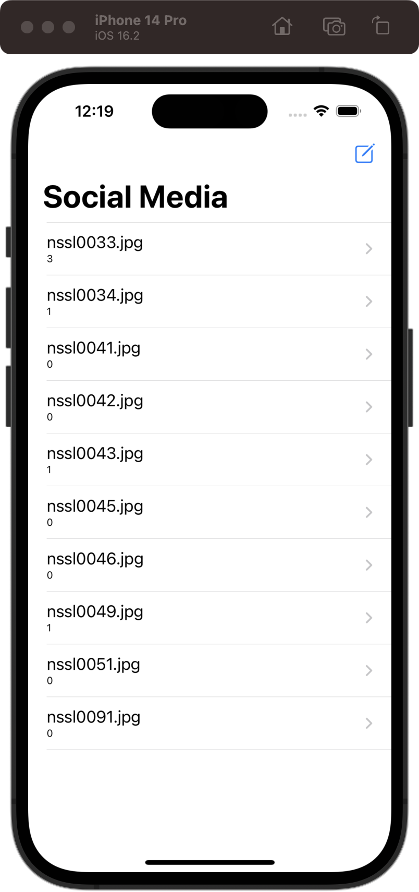
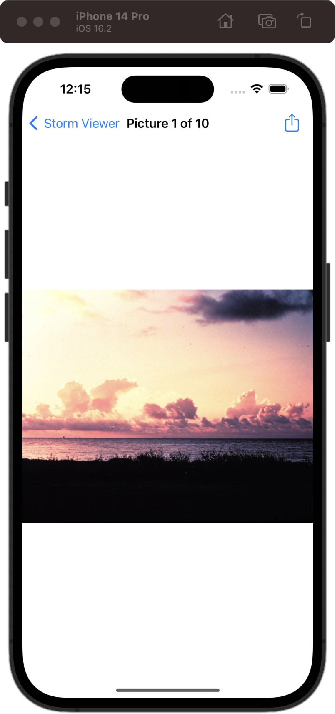
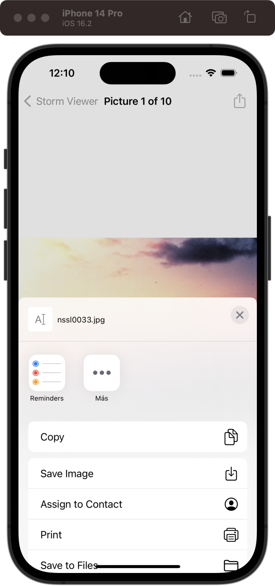
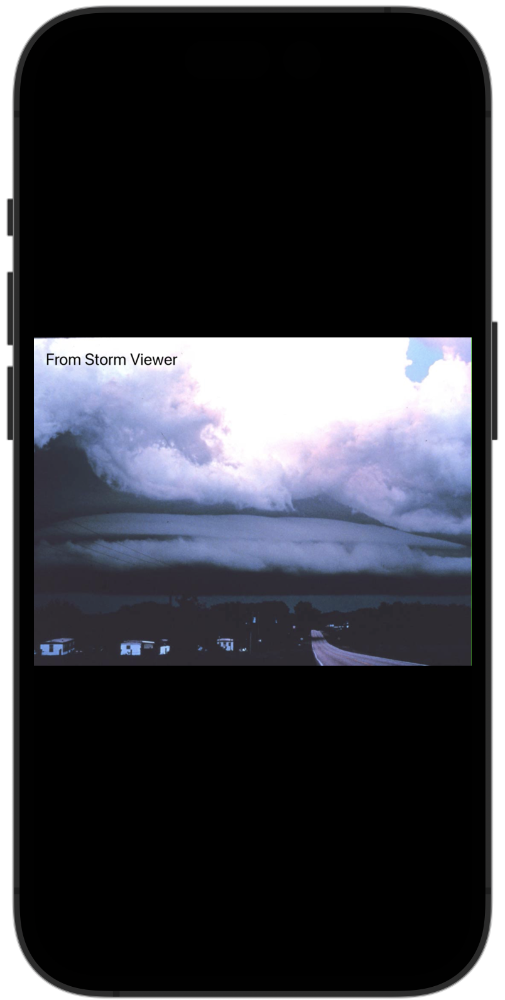

# Social Media

[Project 3](https://www.hackingwithswift.com/read/3/overview) from the [100 Days of Swift course](https://www.hackingwithswift.com/100) by [Hacking With Swift](https://www.hackingwithswift.com/).

## Contents

| Day                                           | Contents                                                                                                                                                                                                                                                                                                                                                                                                                          |
|-----------------------------------------------|-----------------------------------------------------------------------------------------------------------------------------------------------------------------------------------------------------------------------------------------------------------------------------------------------------------------------------------------------------------------------------------------------------------------------------------|
| [22](https://www.hackingwithswift.com/100/22) | <ul><li>[About technique projects](https://www.hackingwithswift.com/read/3/1/about-technique-projects)</li><li>[UIActivityViewController explained](https://www.hackingwithswift.com/read/3/2/uiactivityviewcontroller-explained)</li><li>[Wrap up](https://www.hackingwithswift.com/read/3/3/wrap-up)</li><li>[Review for Project 3: Social media](https://www.hackingwithswift.com/review/hws/project-3-social-media)</li></ul> |

## I Have Learnt...

- `UIBarButtonItem`: Bar button item that can be added to a navigation bar (e.g. navigationItem.rightBarButtonItem).
- `UIActivityViewController`: Provides a standard interface for sharing content with other apps or services on an iOS device. The same as a sharing `Intent` in Android.
- `Info.plist`: It's a special file that contains metadata about the app. It's located at the root of the app's project folder. It's similar to the `AndroidManifest.xml` file in Android. In this project, I used it to add the Privacy permission for being able to store an image in the photo library.
- Saving an image as a `.jpeg` with `jpegData(compressionQuality:)`.

## Challenges

**NOTE**: Includes all challenges of [project 1](https://github.com/HenestrosaConH/100-days-of-swift/tree/main/Courses/01-StormViewer).

Taken from [here](https://www.hackingwithswift.com/read/3/3/wrap-up):

>- [x] Try adding the image name to the list of items that are shared. The `activityItems` parameter is an array, so you can add strings and other things freely. Note: Facebook won’t let you share text, but most other share options will.
>- [x] Go back to [project 1](https://github.com/HenestrosaConH/100-days-of-swift/tree/main/Courses/01-StormViewer) and add a bar button item to the main view controller that recommends the app to other people.
>- [x] Go back to [project 2](https://github.com/HenestrosaConH/100-days-of-swift/tree/main/Courses/02-GuessTheFlag) and add a bar button item that shows their score when tapped.
>- [x] ([Day 89](https://www.hackingwithswift.com/read/27/7/wrap-up)) Go back to project 3 and change the way the selected image is shared so that it has some rendered text on top saying “From Storm Viewer”. This means reading the `size` property of the original image, creating a new canvas at that size, drawing the image in, then adding your text on top.

## Screenshots

  
  
  
  

