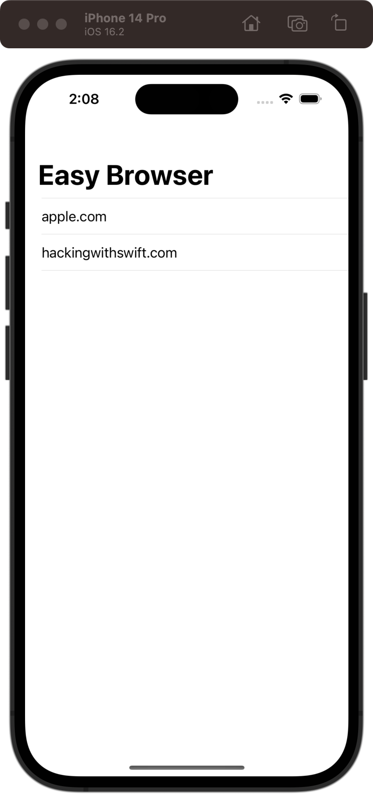
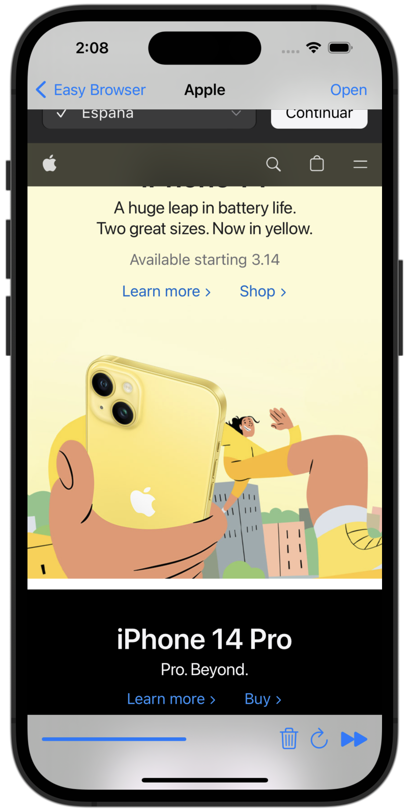

# Easy Browser

[Project 4](https://www.hackingwithswift.com/read/4/overview) from the [100 Days of Swift course](https://www.hackingwithswift.com/100) by [Hacking With Swift](https://www.hackingwithswift.com/).

## Contents

|                      Day                      | Contents                                                                                                                                                                                                                                                                                    |
|:---------------------------------------------:|:--------------------------------------------------------------------------------------------------------------------------------------------------------------------------------------------------------------------------------------------------------------------------------------------|
| [24](https://www.hackingwithswift.com/100/24) | <ul><li>[Setting up](https://www.hackingwithswift.com/read/4/1/setting-up)</li><li>[Creating a simple browser with WKWebView](https://www.hackingwithswift.com/read/4/2)</li><li>[Choosing a website: UIAlertController action sheets](https://www.hackingwithswift.com/read/4/3)</li></ul> |
| [25](https://www.hackingwithswift.com/100/25) | <ul><li>[Monitoring page loads: UIToolbar and UIProgressView](https://www.hackingwithswift.com/read/4/4)</li><li>[Refactoring for the win](https://www.hackingwithswift.com/read/4/5)</li>                                                                                                  | 
| [26](https://www.hackingwithswift.com/100/26) | <ul><li>[Wrap up](https://www.hackingwithswift.com/read/4/6/wrap-up)</li><li>[Review for Project 4: Easy Browser](https://www.hackingwithswift.com/review/hws/project-4-easy-browser)</li>                                                                                                  |

## I Have Learnt...

- `loadView()`: `loadView()` + `viewDidLoad()` = `onCreate()` in Android.
- `WKWebView`: A class in the iOS development framework WebKit that allows developers to embed web content in their apps.
- Delegation of protocols: Design pattern that allows an object to pass responsibility for a particular task or behavior to another object. In the context of iOS development, delegation is often used with protocols to define a set of methods that a delegate object can implement to customize the behavior of another object.
- `URL` and `URLRequest` classes for working with network resources.
- `UIToolbar`: Represents a horizontal bar of buttons or controls that can be added to a view. It's commonly used in conjunction with a UINavigationController to provide a consistent user interface across an app's views. It can contain UIBarButtonItems, custom views, and other controls that can trigger actions when tapped.
- `UIProgressView`: Displays the progress of a task using a progress bar. 
- Key-Value observing: Design pattern in iOS development that allows objects to observe changes to the properties of other objects, without having to know the details of how those properties are implemented.

## Challenges

Taken from [here](https://www.hackingwithswift.com/read/4/6/wrap-up):

>- [x] If users try to visit a URL that isn’t allowed, show an alert saying it’s blocked.
>- [x] Try making two new toolbar items with the titles Back and Forward. You should make them use `webView.goBack` and `webView.goForward`.
>- [x] For more of a challenge, try changing the initial view controller to a table view like in project 1, where users can choose their website from a list rather than just having the first in the array loaded up front.

## Screenshots

  
  

