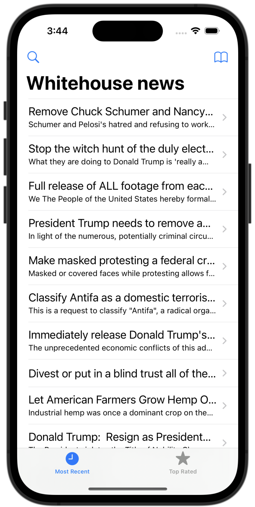

# Whitehouse Petitions Async

[Project 9](https://www.hackingwithswift.com/read/9/overview) from the [100 Days of Swift course](https://www.hackingwithswift.com/100) by [Hacking With Swift](https://www.hackingwithswift.com/).

## Contents

|                      Day                      | Contents                                                                                                                                                                                                                                                                                                                                                                                                                                       |
|:---------------------------------------------:|:-----------------------------------------------------------------------------------------------------------------------------------------------------------------------------------------------------------------------------------------------------------------------------------------------------------------------------------------------------------------------------------------------------------------------------------------------|
| [39](https://www.hackingwithswift.com/100/39) | <ul><li>[Setting up](https://www.hackingwithswift.com/read/9/1/setting-up)</li><li>[Why is locking the UI bad?](https://www.hackingwithswift.com/read/9/2)</li><li>[GCD 101: async()](https://www.hackingwithswift.com/read/9/3)</li><li>[Back to the main thread: DispatchQueue.main](https://www.hackingwithswift.com/read/9/4)</li><li>[Easy GCD using performSelector(inBackground:)](https://www.hackingwithswift.com/read/9/5)</li></ul> |
| [40](https://www.hackingwithswift.com/100/40) | <ul><li>[Wrap up](https://www.hackingwithswift.com/read/9/6)</li><li>[Review for Project 9: Grand Central Dispatch](https://www.hackingwithswift.com/review/hws/project-9-grand-central-dispatch)</li></ul>                                                                                                                                                                                                                                    |

## I Have Learnt...

- Async petitions with `performSelector(inBackground:)`

## Challenges

Taken from [here](https://www.hackingwithswift.com/read/9/6/wrap-up):

>- [x] Modify [project 1](https://github.com/HenestrosaConH/100-days-of-swift/tree/main/Courses/01-StormViewer) so that loading the list of NSSL images from our bundle happens in the background. Make sure you call `reloadData()` on the table view once loading has finished!
>- [x] Modify [project 8](https://github.com/HenestrosaConH/100-days-of-swift/tree/main/Courses/08-SevenSwiftyWords) so that loading and parsing a level takes place in the background. Once you’re done, make sure you update the UI on the main thread!
>- [x] Modify [project 7](https://github.com/HenestrosaConH/100-days-of-swift/tree/main/Courses/07-WhitehousePetitions) so that your filtering code takes place in the background. This filtering code was added in one of the challenges for the project, so hopefully you didn't skip it!

## Screenshots

  
  

