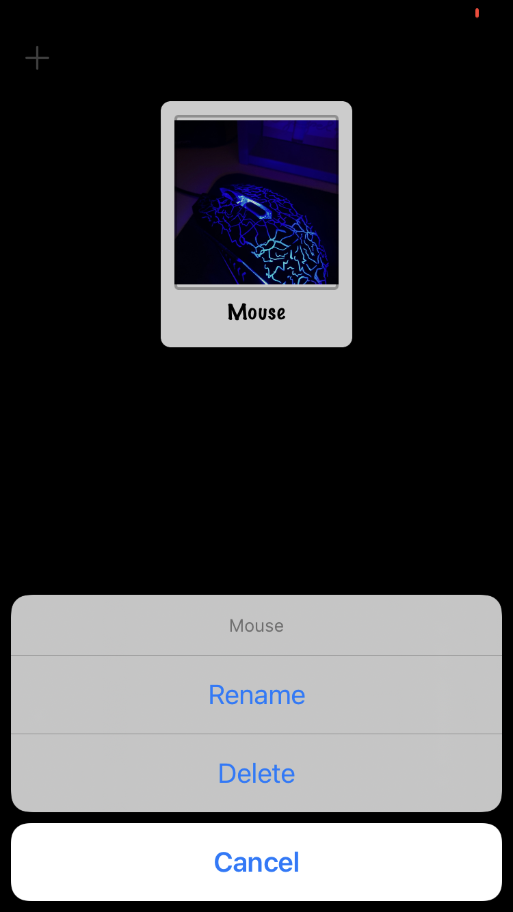

# Names To Faces

[Project 10](https://www.hackingwithswift.com/read/10/overview) from the [100 Days of Swift course](https://www.hackingwithswift.com/100) by [Hacking With Swift](https://www.hackingwithswift.com/).

## Contents

|                      Day                      | Contents                                                                                                                                                                                                                                                                         |
|:---------------------------------------------:|:---------------------------------------------------------------------------------------------------------------------------------------------------------------------------------------------------------------------------------------------------------------------------------|
| [42](https://www.hackingwithswift.com/100/42) | <ul><li>[Setting up](https://www.hackingwithswift.com/read/10/1/setting-up)</li><li>[Designing UICollectionView cells](https://www.hackingwithswift.com/read/10/2)</li><li>[UICollectionView data sources](https://www.hackingwithswift.com/read/10/3)</li></ul>                 |
| [43](https://www.hackingwithswift.com/100/43) | <ul><li>[Importing photos with UIImagePickerController](https://www.hackingwithswift.com/read/10/4)</li><li>[Custom subclasses of NSObject](https://www.hackingwithswift.com/read/10/5)</li><li>[Connecting up the people](https://www.hackingwithswift.com/read/10/6)</li></ul> | 
| [44](https://www.hackingwithswift.com/100/44) | <ul><li>[Wrap up](https://www.hackingwithswift.com/read/10/7/wrap-up)</li><li>[Review for Project 10: Names To Faces](https://www.hackingwithswift.com/review/hws/project-10-names-to-faces)</li></ul>                                                                           |

## I've learnt...

- `UICollectionView`: Like a `RecyclerView` with `CardView` in Android.
- `UIImagePickerController` for picking images from the gallery.
- `UUID` (Universal Unique IDentifier)
- `NSObject` subclasses
- `fatalError()`

## Challenges

Taken from [here](https://www.hackingwithswift.com/read/10/7/wrap-up):

>- [x] Add a second `UIAlertController` that gets shown when the user taps a picture, asking them whether they want to rename the person or delete them.
>- [x] Try using `picker.sourceType = .camera` when creating your image picker, which will tell it to create a new image by taking a photo. This is only available on devices (not on the simulator) so you might want to check the return value of `UIImagePickerController.isSourceTypeAvailable()` before trying to use it!
>- [ ] Modify [project 1](https://github.com/HenestrosaConH/100-days-of-swift/tree/main/Courses/01-StormViewer) so that it uses a collection view controller rather than a table view controller. I recommend you keep a copy of your original table view controller code so you can refer back to it later on.
>- [x] ([Day 93](https://www.hackingwithswift.com/read/28/5/wrap-up)) Go back to project 10 and add biometric authentication so the user’s pictures are shown only when they have unlocked the app. You’ll need to give some thought to how you can hide the pictures – perhaps leave the array empty until they are authenticated?

## Screenshots

