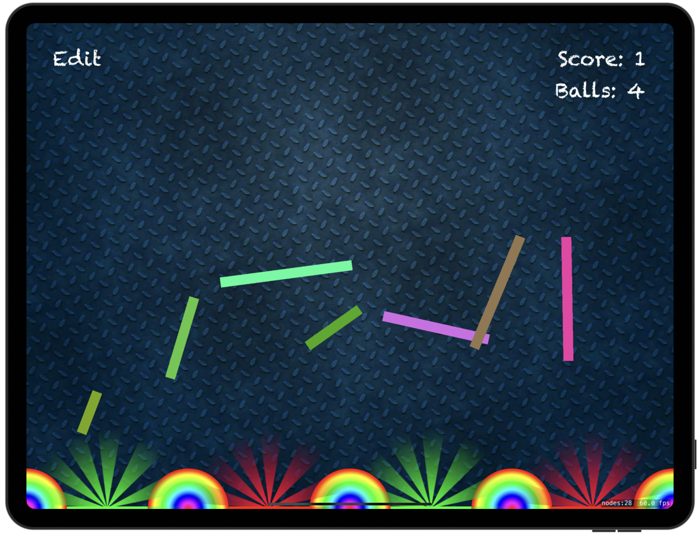

# Pachinko

[Project 11](https://www.hackingwithswift.com/read/11/overview) from the [100 Days of Swift course](https://www.hackingwithswift.com/100) by [Hacking With Swift](https://www.hackingwithswift.com/).

## Contents

|                      Day                      | Contents                                                                                                                                                                                                                                                                             |
|:---------------------------------------------:|:-------------------------------------------------------------------------------------------------------------------------------------------------------------------------------------------------------------------------------------------------------------------------------------|
| [45](https://www.hackingwithswift.com/100/45) | <ul><li>[Setting up](https://www.hackingwithswift.com/read/11/1/setting-up)</li><li>[Falling boxes: SKSpriteNode, UITouch, SKPhysicsBody](https://www.hackingwithswift.com/read/11/2)</li><li>[Bouncing balls: circleOfRadius](https://www.hackingwithswift.com/read/11/3)</li></ul> |
| [46](https://www.hackingwithswift.com/100/46) | <ul><li>[Spinning slots: SKAction](https://www.hackingwithswift.com/read/11/4)</li><li>[Collision detection: SKPhysicsContactDelegate](https://www.hackingwithswift.com/read/11/5)</li><li>[Scores on the board: SKLabelNode](https://www.hackingwithswift.com/read/11/6)</li></ul>  | 
| [47](https://www.hackingwithswift.com/100/47) | <ul><li>[Special effects: SKEmitterNode](https://www.hackingwithswift.com/read/11/7)</li><li>[Wrap up](https://www.hackingwithswift.com/read/11/8/wrap-up)</li><li>[Review for Project 11: Pachinko](https://www.hackingwithswift.com/review/hws/project-11-pachinko)</li></ul>      |

## I Have Learnt...

- `SpriteKit`: iOS framework for games development.
- Physics with `SKPhysicsBody`
- Blend mode: Graphical composition technique used in computer graphics and image processing to combine two or more images or graphics together
- `CGFloat`: Part of **Core Graphics**. type alias in Swift for either Float or Double, depending on the platform on which the app runs. It is often used in iOS and macOS development to specify the size, position, or other properties of UI elements. Different from `Float` and `Double`. 
- `.sks` files: Create and edit visual and graphical elements for games and apps using the SpriteKit framework.

## Challenges

Taken from [here](https://www.hackingwithswift.com/read/11/8/wrap-up):

>- [x] The pictures we’re using in have other ball pictures rather than just “ballRed”. Try writing code to use a random ball color each time they tap the screen.
>- [x] Right now, users can tap anywhere to have a ball created there, which makes the game too easy. Try to force the Y value of new balls so they are near the top of the screen.
>- [x] Give players a limit of five balls, then remove obstacle boxes when they are hit. Can they clear all the pins with just five balls? You could make it so that landing on a green slot gets them an extra ball.

## To Do as a Personal Challenge...

- [ ] Add **Try again** button when showing **Game Over**
- [ ] Show **Game Over** when there are no more balls left

## Screenshots

  

