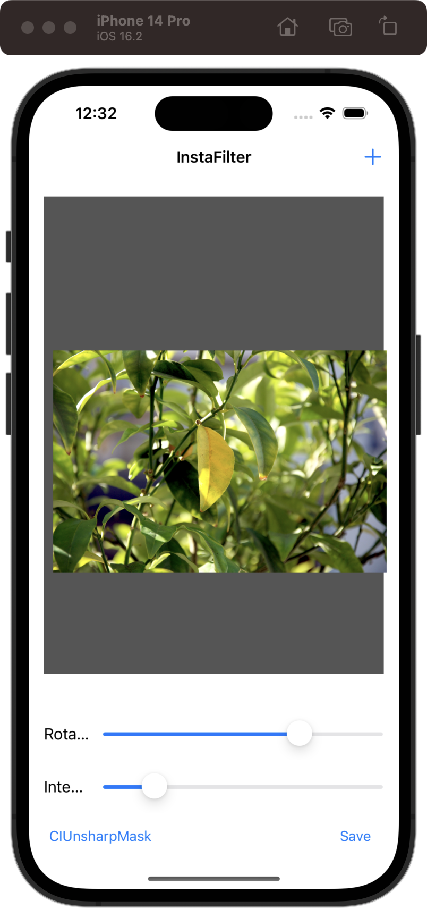
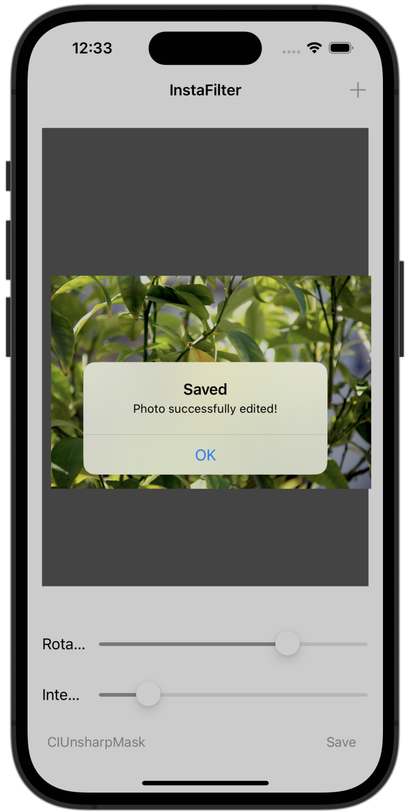

# InstaFilter

[Project 13](https://www.hackingwithswift.com/read/13/overview) from the [100 Days of Swift course](https://www.hackingwithswift.com/100) by [Hacking With Swift](https://www.hackingwithswift.com/).

## Contents

|                      Day                      | Contents                                                                                                                                                                                                                                      |
|:---------------------------------------------:|:----------------------------------------------------------------------------------------------------------------------------------------------------------------------------------------------------------------------------------------------|
| [52](https://www.hackingwithswift.com/100/52) | <ul><li>[Setting up](https://www.hackingwithswift.com/read/13/1/setting-up)</li><li>[Designing the interface](https://www.hackingwithswift.com/read/13/2)</li><li>[Importing a picture](https://www.hackingwithswift.com/read/13/3)</li></ul> |
| [53](https://www.hackingwithswift.com/100/53) | <ul><li>[Applying filters: CIContext, CIFilter](https://www.hackingwithswift.com/read/13/4)</li><li>[Saving to the iOS photo library](https://www.hackingwithswift.com/read/13/5)</li></ul>                                                   | 
| [54](https://www.hackingwithswift.com/100/54) | <ul><li>[Wrap up](https://www.hackingwithswift.com/read/13/5)</li><li>[Review for Project 13: Instafilter](https://www.hackingwithswift.com/review/hws/project-13-instafilter)</li></ul>                                                      |

## I Have Learnt...

- `CoreImage` filters following these steps:
  1. Create a `CIImage` object from the input image.
        ```
        let inputImage = UIImage(named: "inputImage.jpg")!
        let ciImage = CIImage(image: inputImage)
        ```
  2. Create a filter object and set its input parameters.
        ```
        let filter = CIFilter(name: "CIColorControls")!
        filter.setValue(ciImage, forKey: kCIInputImageKey)
        filter.setValue(0.5, forKey: kCIInputBrightnessKey)
        ```
  3. Apply the filter to the input image and get the output image.
        ```
        let outputImage = filter.outputImage!
        ```
  4. Render the output image to a `UIImage` object.
        ```
        let context = CIContext(options: nil)
        let cgImage = context.createCGImage(outputImage, from: outputImage.extent)
        let outputUIImage = UIImage(cgImage: cgImage!)
        ```
- `UISlider`: Subclass of `UIView` that allows users to select a value by sliding a thumb along a horizontal track.
- Writing images to the iOS photo album with `UIImageWriteToSavedPhotosAlbum`.

## Challenges

Taken from [here](https://www.hackingwithswift.com/read/13/5):

>- [x] Try making the Save button show an error if there was no image in the image view.
>- [x] Make the Change Filter button change its title to show the name of the currently selected filter.
>- [x] Experiment with having more than one slider, to control each of the input keys you care about. For example, you might have one for radius and one for intensity.
>- [x] ([Day 58](https://www.hackingwithswift.com/read/15/5/wrap-up)) Make the image view fade in when a new picture is chosen. To make this work, set the alpha to 0 first.

## To Do as a Personal Challenge...

- [ ] To add more filters
- [ ] To change the label and the functionality of the value of the sliders depending on which parameters the filter can handle (brightness, rotation, intensity...)

## Screenshots

<div align="center">
  
  
  
</div>
