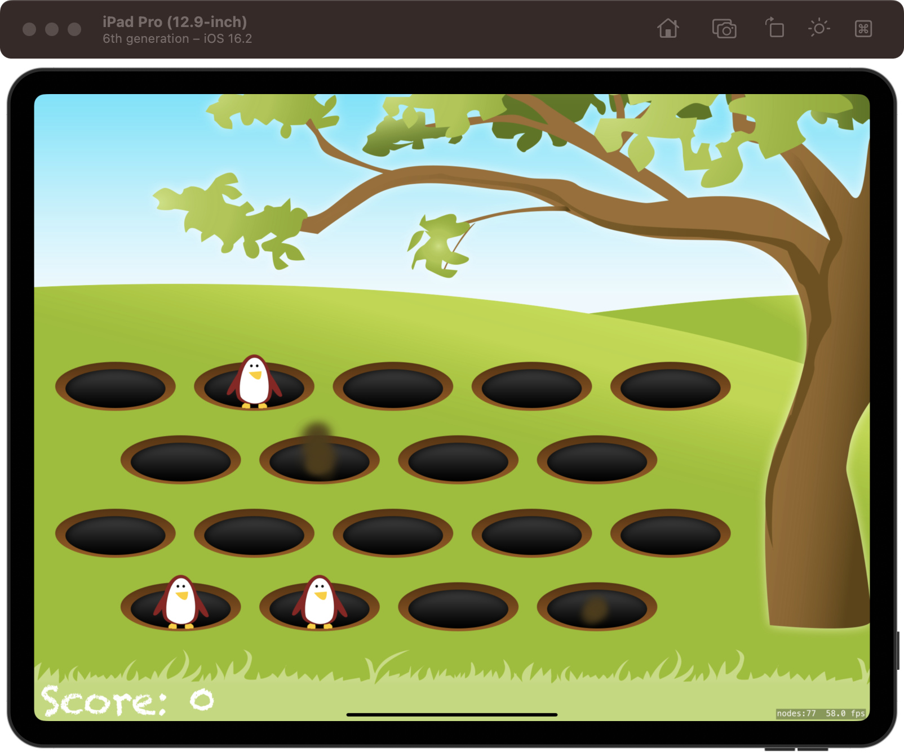
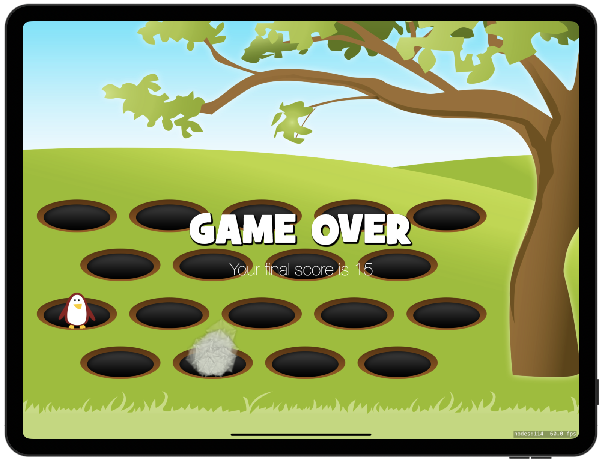

# Whack-a-Penguin

[Project 14](https://www.hackingwithswift.com/read/14/overview) from the [100 Days of Swift course](https://www.hackingwithswift.com/100) by [Hacking With Swift](https://www.hackingwithswift.com/).

## Contents

|                      Day                      | Contents                                                                                                                                                                                                                                                                                   |
|:---------------------------------------------:|:-------------------------------------------------------------------------------------------------------------------------------------------------------------------------------------------------------------------------------------------------------------------------------------------|
| [55](https://www.hackingwithswift.com/100/55) | <ul><li>[Setting up](https://www.hackingwithswift.com/read/14/1/setting-up)</li><li>[Getting up and running: SKCropNode](https://www.hackingwithswift.com/read/14/2)</li><li>[Penguin, show thyself: SKAction moveBy(x:y:duration:)](https://www.hackingwithswift.com/read/14/3)</li></ul> |
| [56](https://www.hackingwithswift.com/100/56) | <ul><li>[Whack to win: SKAction sequences](https://www.hackingwithswift.com/read/14/4)</li><li>[Wrap up](https://www.hackingwithswift.com/read/14/5)</li><li>[Review for Project 14: Whack-a-Penguin](https://www.hackingwithswift.com/read/14/6)</li></ul>                                | 

## I've learnt...

- `SKCropNode`
- `SKTexture`
- `asyncAfter()`
- New `SKAction` types.

## Challenges

Taken from [here](https://www.hackingwithswift.com/read/14/5):

>- [x] Record your own voice saying "Game over!" and have it play when the game ends.
>- [x] When showing “Game Over” add an `SKLabelNode` showing their final score.
>- [x] Use `SKEmitterNode` to create a smoke-like effect when penguins are hit, and a separate mud-like effect when they go into or come out of a hole. (This challenge needs some rework because when some penguins hide, the mud particle appears below the hole)

## To do as a personal challenge...

- [ ] To add a max score with UserDefaults
- [ ] Difficulties
- [ ] Retry button
- [ ] Add **Try again** button when showing **Game Over**

## Screenshots

