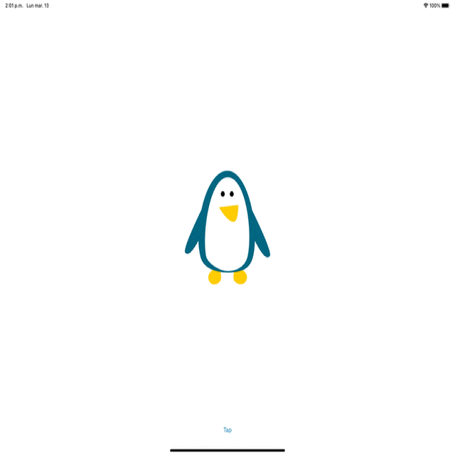

# Animation

[Project 15](https://www.hackingwithswift.com/read/15/overview) from the [100 Days of Swift course](https://www.hackingwithswift.com/100) by [Hacking With Swift](https://www.hackingwithswift.com/).

## Contents

|                      Day                      | Contents                                                                                                                                                                                                                                                                                                                                                |
|:---------------------------------------------:|:--------------------------------------------------------------------------------------------------------------------------------------------------------------------------------------------------------------------------------------------------------------------------------------------------------------------------------------------------------|
| [57](https://www.hackingwithswift.com/100/57) | <ul><li>[Setting up](https://www.hackingwithswift.com/read/15/1/setting-up)</li><li>[Preparing for action](https://www.hackingwithswift.com/read/15/2)</li><li>[Switch, case, animate: animate(withDuration:)](https://www.hackingwithswift.com/read/15/3)</li><li>[Transform: CGAffineTransform](https://www.hackingwithswift.com/read/15/4)</li></ul> |
| [58](https://www.hackingwithswift.com/100/58) | <ul><li>[Wrap up](https://www.hackingwithswift.com/read/15/5)</li><li>[Review for Project 15: Animation](https://www.hackingwithswift.com/review/hws/project-15-animation)</li></ul>                                                                                                                                                                    | 

## I Have Learnt...

- `animate(withDuration:)`: Class method of the `UIView` class in iOS, which allows you to create and run animations on a view
- Spring animations: Type of animation in iOS that create a bouncing or spring-like effect in a view as it moves, scales, or rotates. They are designed to provide a more natural, fluid and responsive feel to the animations.
- The `CGAffineTransform` struct provides several methods to create, manipulate and combine transformation matrices.

## Challenges

Taken from [here](https://www.hackingwithswift.com/read/15/5):

>- [x] Go back to [project 8](https://github.com/HenestrosaConH/100-days-of-swift/tree/main/Courses/08-SevenSwiftyWords) and make the letter group buttons fade out when they are tapped. We were using the `isHidden` property, but you'll need to switch to `alpha` because `isHidden` is either true or false, it has no animatable values between.
>- [x] Go back to [project 13](https://github.com/HenestrosaConH/100-days-of-swift/tree/main/Courses/13-InstaFilter) and make the image view fade in when a new picture is chosen. To make this work, set the `alpha` to 0 first.
>- [ ] Go back to [project 2](https://github.com/HenestrosaConH/100-days-of-swift/tree/main/Courses/02-GuessTheFlag) and make the flags scale down with a little bounce when pressed.

## Screenshots

  

