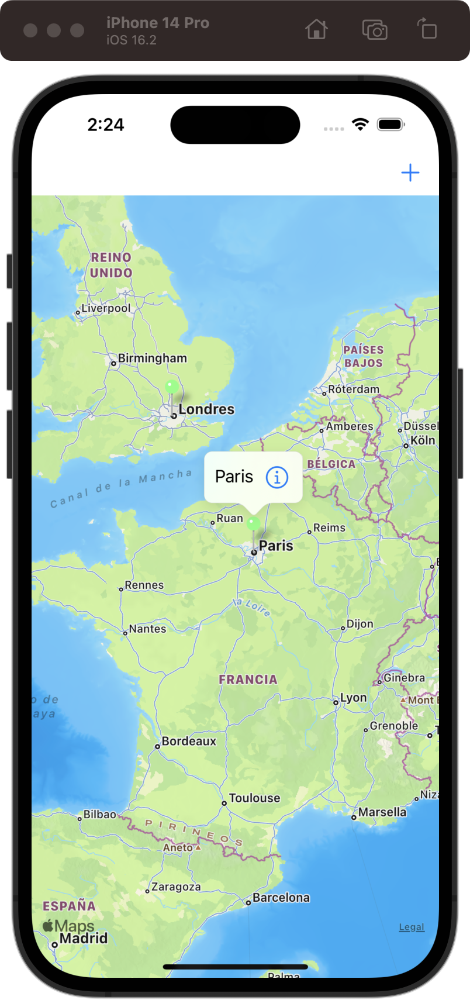
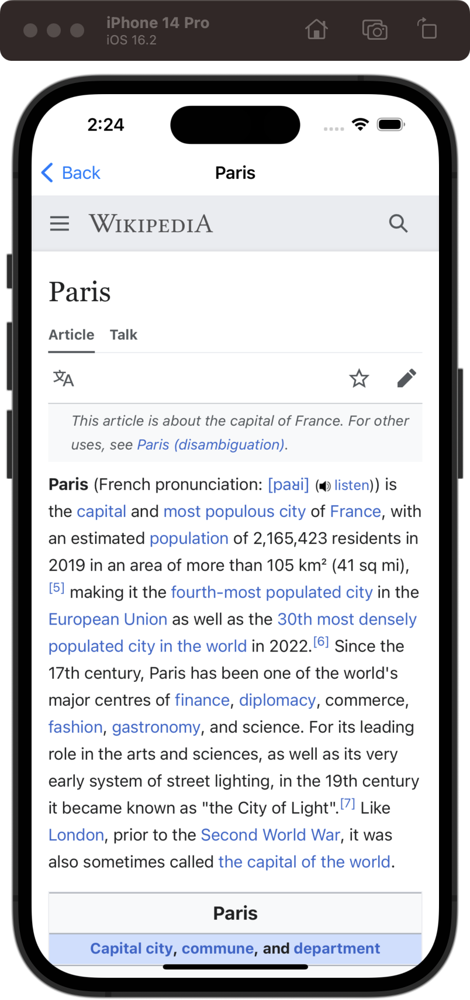

# Capital Cities

[Project 16](https://www.hackingwithswift.com/read/16/overview) from the [100 Days of Swift course](https://www.hackingwithswift.com/100) by [Hacking With Swift](https://www.hackingwithswift.com/).

## Contents

|                      Day                      | Contents                                                                                                                                                                                                                                                                          |
|:---------------------------------------------:|:----------------------------------------------------------------------------------------------------------------------------------------------------------------------------------------------------------------------------------------------------------------------------------|
| [60](https://www.hackingwithswift.com/100/60) | <ul><li>[Setting up](https://www.hackingwithswift.com/read/16/1/setting-up)</li><li>[Up and running with MapKit](https://www.hackingwithswift.com/read/16/2)</li><li>[Annotations and accessory views: MKPinAnnotationView](https://www.hackingwithswift.com/read/16/3)</li></ul> |
| [61](https://www.hackingwithswift.com/100/61) | <ul><li>[Wrap up](https://www.hackingwithswift.com/read/16/4)</li><li>[Review for Project 16: Capital Cities](https://www.hackingwithswift.com/review/hws/project-16-capital-cities)</li></ul>                                                                                    |

## I've learnt...

- `MKMapView`
- `MKAnnotation`
- `MKPinAnnotationView`
- `CLLocationCoordinate2D`

## Challenges

Taken from [here](https://www.hackingwithswift.com/read/16/4):

>- [x] Try typecasting the return value from `dequeueReusableAnnotationView()` so that it's an `MKPinAnnotationView`. Once that’s done, change the `pinTintColor` property to your favorite `UIColor`.
>- [x] Add a `UIAlertController` that lets users specify how they want to view the map. There's a `mapType` property that draws the maps in different ways. For example, `.satellite` gives a satellite view of the terrain.
>- [x] Modify the callout button so that pressing it shows a new view controller with a web view, taking users to the Wikipedia entry for that city.

## Screenshots

