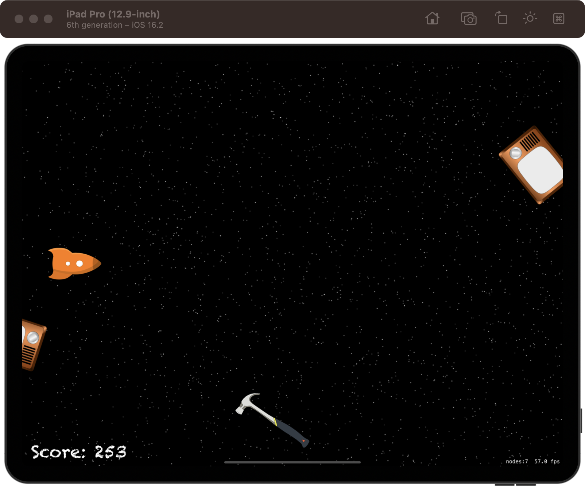

# Space Race

[Project 17](https://www.hackingwithswift.com/read/17/overview) from the [100 Days of Swift course](https://www.hackingwithswift.com/100) by [Hacking With Swift](https://www.hackingwithswift.com/).

## Contents

|                      Day                      | Contents                                                                                                                                                                                                                                                                                                                                                         |
|:---------------------------------------------:|:-----------------------------------------------------------------------------------------------------------------------------------------------------------------------------------------------------------------------------------------------------------------------------------------------------------------------------------------------------------------|
| [62](https://www.hackingwithswift.com/100/62) | <ul><li>[Setting up](https://www.hackingwithswift.com/read/17/1/setting-up)</li><li>[Space: the final frontier](https://www.hackingwithswift.com/read/17/2)</li><li>[Bring on the enemies: linearDamping, angularDamping](https://www.hackingwithswift.com/read/17/3)</li><li>[Making contact: didBegin()](https://www.hackingwithswift.com/read/17/4)</li></ul> |
| [63](https://www.hackingwithswift.com/100/63) | <ul><li>[Wrap up](https://www.hackingwithswift.com/read/17/5)</li><li>[Review for Project 17: Space Race](https://www.hackingwithswift.com/review/hws/project-17-space-race)</li></ul>                                                                                                                                                                           |

## I've learnt...

- Per-pixel collision detection (`SKPhysicsBody(texture:)`). Gets pixel-perfect physics. This is computationally expensive, so it should be used only when strictly needed.
- Advancing particle systems (`advanceSimulationTime(seconds)`)
- `Timer`
- Linear and angular damping (friction simulator)

## Challenges

Taken from [here](https://www.hackingwithswift.com/read/17/5):

>- [x] Stop the player from cheating by lifting their finger and tapping elsewhere – try implementing touchesEnded() to make it work.
>- [x] Make the timer start at one second, but then after 20 enemies have been made subtract 0.1 seconds from it so it’s triggered every 0.9 seconds. After making 20 more, subtract another 0.1, and so on. Note: you should call invalidate() on gameTimer before giving it a new value, otherwise you end up with multiple timers.
>- [x] Stop creating space debris after the player has died.

## To do as a personal challenge...

- [x] Add Game Over sprite 
- [ ] Add max. score with UserDefaults
- [ ] Add **Try again** button when showing **Game Over**

## Screenshots

