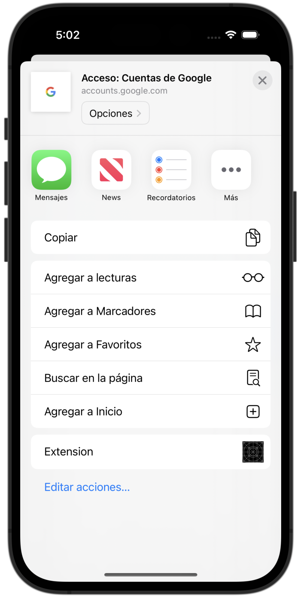
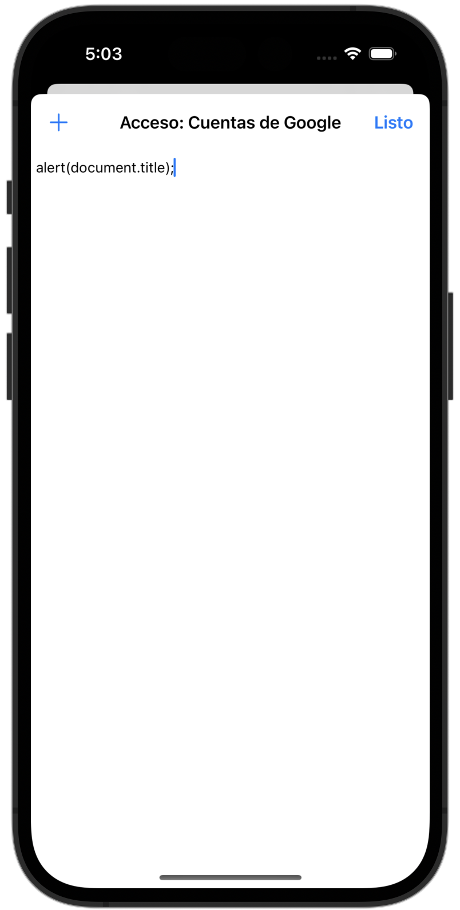
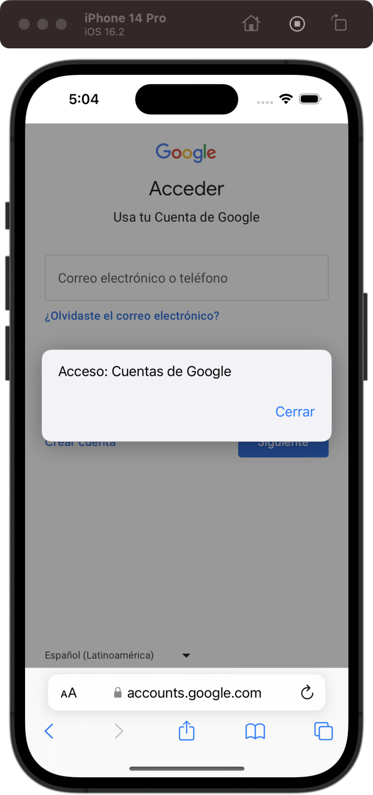
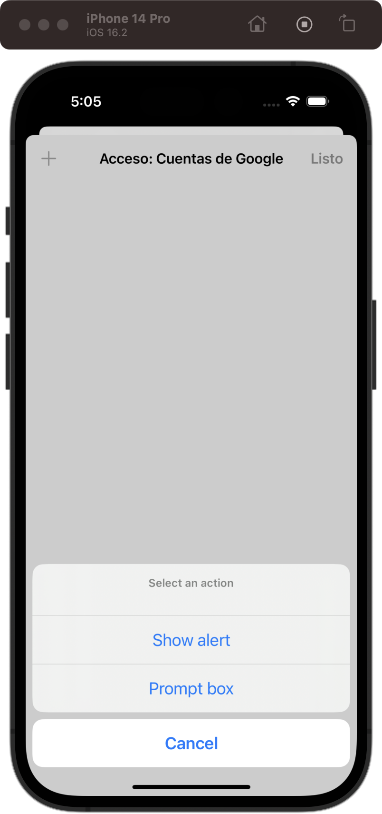

# JavaScript Injection

[Project 19](https://www.hackingwithswift.com/read/19/overview) from the [100 Days of Swift course](https://www.hackingwithswift.com/100) by [Hacking With Swift](https://www.hackingwithswift.com/).

## Contents

|                      Day                      | Contents                                                                                                                                                                                                                                                                                                                                 |
|:---------------------------------------------:|:-----------------------------------------------------------------------------------------------------------------------------------------------------------------------------------------------------------------------------------------------------------------------------------------------------------------------------------------|
| [67](https://www.hackingwithswift.com/100/67) | <ul><li>[Setting up](https://www.hackingwithswift.com/read/19/1/setting-up)</li><li>[Making a shell app](https://www.hackingwithswift.com/read/19/2)</li><li>[Adding an extension: NSExtensionItem](https://www.hackingwithswift.com/read/19/3)</li><li>[What do you want to get?](https://www.hackingwithswift.com/read/19/4)</li></ul> |
| [68](https://www.hackingwithswift.com/100/68) | <ul><li>[Establishing communication](https://www.hackingwithswift.com/read/19/5)</li><li>[Editing multiline text with UITextView](https://www.hackingwithswift.com/read/19/6)</li><li>[Fixing the keyboard: NotificationCenter](https://www.hackingwithswift.com/read/19/7)</li></ul>                                                    |
| [69](https://www.hackingwithswift.com/100/69) | <ul><li>[Wrap up](https://www.hackingwithswift.com/read/19/8)</li><li>[Review for Project 19: JavaScript Injection](https://www.hackingwithswift.com/review/hws/project-19-javascript-injection)</li></ul>                                                                                                                               |

## I've learnt...

- Targets (we used it for the Extension)
- JavaScript injections

## Challenges

Taken from [here](https://www.hackingwithswift.com/read/19/8):

>- [x] Add a bar button item that lets users select from a handful of prewritten example scripts, shown using a `UIAlertController` – at the very least your list should include the example we used in this project.
>- [ ] You're already receiving the URL of the site the user is on, so use UserDefaults to save the user's JavaScript for each site. You should convert the URL to a URL object in order to use its host property.
>- [ ] For something bigger, let users name their scripts, then select one to load using a UITableView.

## Screenshots

