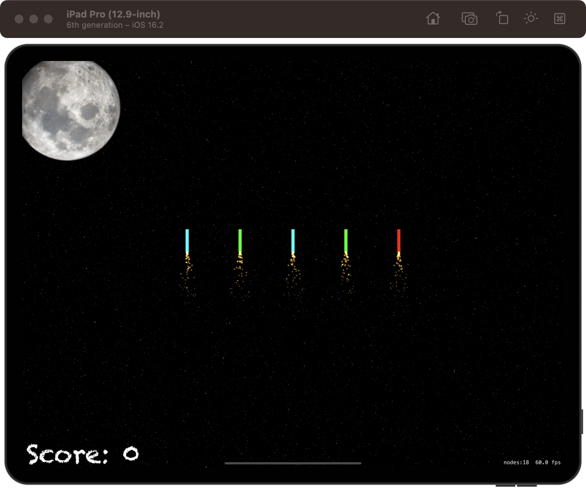
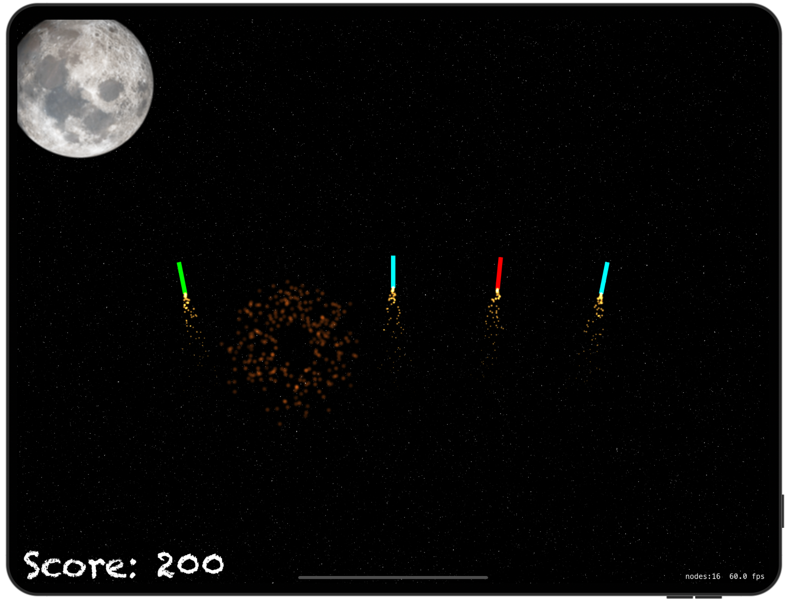

# Fireworks Night

[Project 20](https://www.hackingwithswift.com/read/20/overview) from the [100 Days of Swift course](https://www.hackingwithswift.com/100) by [Hacking With Swift](https://www.hackingwithswift.com/).

## Contents

|                      Day                      | Contents                                                                                                                                                                                                                                                                                    |
|:---------------------------------------------:|:--------------------------------------------------------------------------------------------------------------------------------------------------------------------------------------------------------------------------------------------------------------------------------------------|
| [70](https://www.hackingwithswift.com/100/70) | <ul><li>[Setting up](https://www.hackingwithswift.com/read/20/1/setting-up)</li><li>[Ready... aim... fire: Timer and follow()](https://www.hackingwithswift.com/read/20/2)</li><li>[Swipe to select](https://www.hackingwithswift.com/read/20/3)</li></ul>                                  |
| [71](https://www.hackingwithswift.com/100/71) | <ul><li>[Making things go bang: SKEmitterNode](https://www.hackingwithswift.com/read/20/4)</li><li>[Wrap up](https://www.hackingwithswift.com/read/20/5)</li><li>[Review for Project 20: Fireworks Night](https://www.hackingwithswift.com/review/hws/project-20-fireworks-night)</li></ul> |

## I've learnt...

- `follow()`. Makes the node move along the path specified as, in the case of the project, path.cgPath
- `UIBezierPath` for drawing curve trajectories.
- `for case let <variable> as <dataType> in <iteratable> { ... }`: This means that, if the element inside the <iteratable> can be casted as <dataType>, we'll go into the loop.
- Color blending
- Shake gesture with `override func motionBegan(_ motion: UIEvent.EventSubtype, with event: UIEvent?) { ... }` in the `GameViewController` class. 
        
## Challenges

Taken from [here](https://www.hackingwithswift.com/read/20/5):

>- [x] For an easy challenge try adding a score label that updates as the player's score changes
>- [x] Make the game end after a certain number of launches. You will need to use the `invalidate()` method of `Timer` to stop it from repeating.
>- [x] Use the `waitForDuration` and `removeFromParent` actions in a sequence to make sure explosion particle emitters are removed from the game scene when they are finished.

## To do as a personal challenge...

- [ ] Add UserDefaults to store the max. score
- [ ] Add **Explode** button
- [ ] Add **Try again** button when showing **Game Over**

## Screenshots

