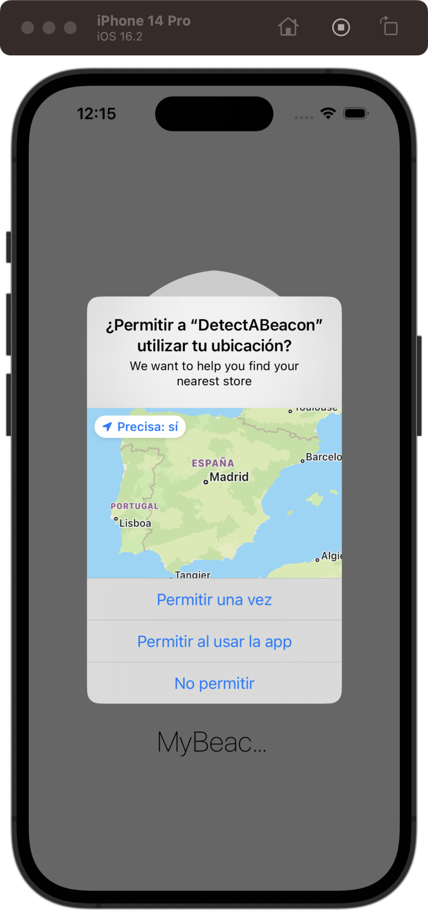
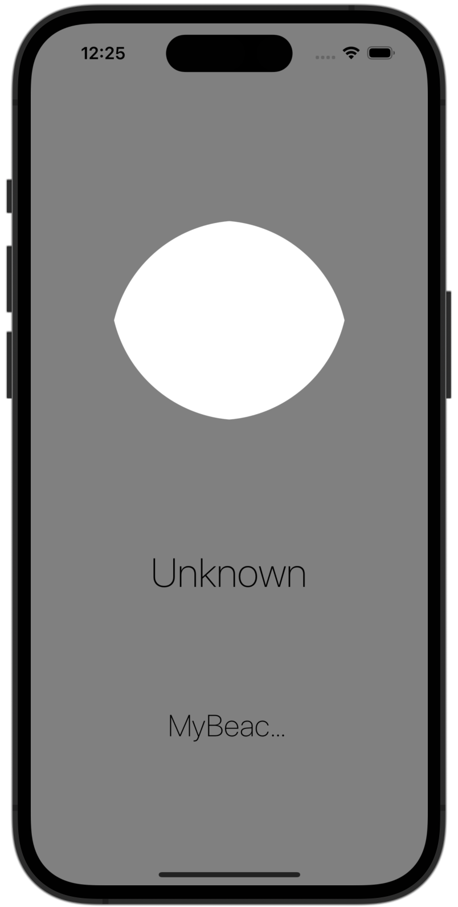

# Detect-a-Beacon

[Project 22](https://www.hackingwithswift.com/read/22/overview) from the [100 Days of Swift course](https://www.hackingwithswift.com/100) by [Hacking With Swift](https://www.hackingwithswift.com/).

## Contents

|                      Day                      | Contents                                                                                                                                                                                                                                                                |
|:---------------------------------------------:|:------------------------------------------------------------------------------------------------------------------------------------------------------------------------------------------------------------------------------------------------------------------------|
| [75](https://www.hackingwithswift.com/100/75) | <ul><li>[Setting up](https://www.hackingwithswift.com/read/22/1/setting-up)</li><li>[Requesting location: Core Location](https://www.hackingwithswift.com/read/22/2)</li><li>[Hunting the beacon: CLBeaconRegion](https://www.hackingwithswift.com/read/22/3)</li></ul> |
| [76](https://www.hackingwithswift.com/100/76) | <ul><li>[Wrap up](https://www.hackingwithswift.com/read/22/4)</li><li>[Review for Project 22: Detect-a-Beacon](https://www.hackingwithswift.com/review/hws/project-22-detect-a-beacon)</li></ul>                                                                        |

## Note

Keep in mind that iBeacons are pretty much dead now, so I basically did this course for completion.

## I've learnt...

- iBeacons: Bluetooth-powered microdevices that emit low-energy signals iOS can detect and act on.
- Ask for location authorization (while in use and always)

## Challenges

Taken from [here](https://www.hackingwithswift.com/read/22/4):

>- [x] Write code that shows a `UIAlertController` when your beacon is first detected. Make sure you set a Boolean to say the alert has been shown, so it doesn’t keep appearing.
>- [x] Go through two or three other iBeacons in the Detect Beacon app and add their UUIDs to your app, then register all of them with iOS. Now add a second label to the app that shows new text depending on which beacon was located.
>- [x] Add a circle to your view, then use animation to scale it up and down depending on the distance from the beacon – try 0.001 for unknown, 0.25 for far, 0.5 for near, and 1.0 for immediate. You can make the circle by adding an image, or by creating a view that’s 256 wide by 256 high then setting its layer.cornerRadius to 128 so that it’s round.

## Screenshots

