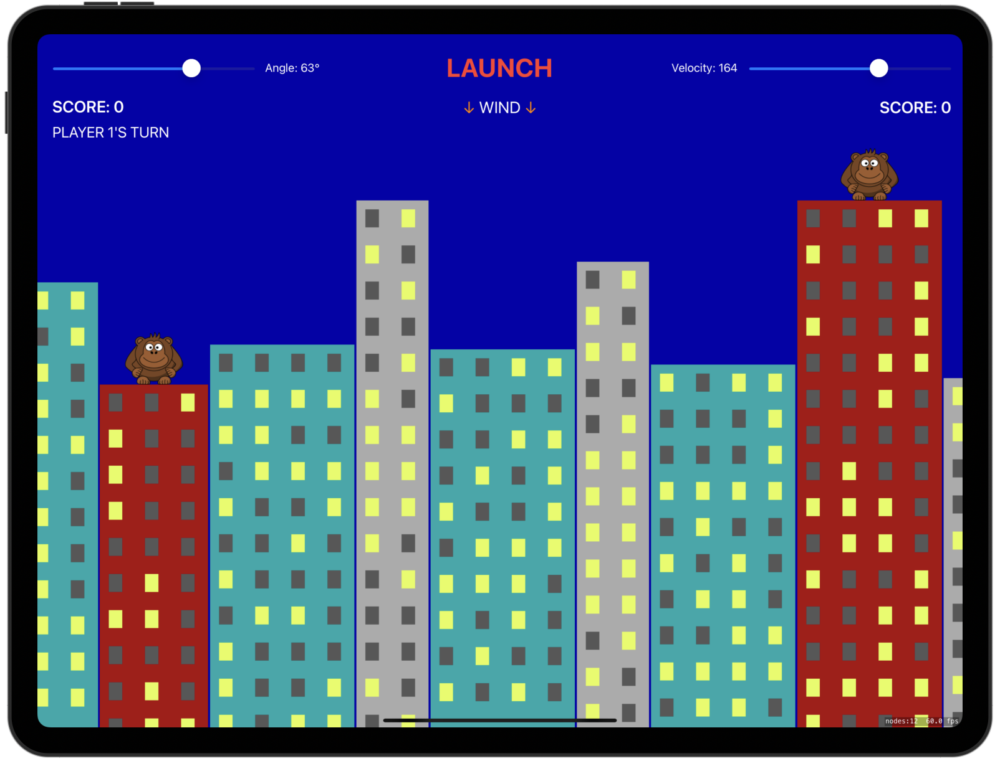
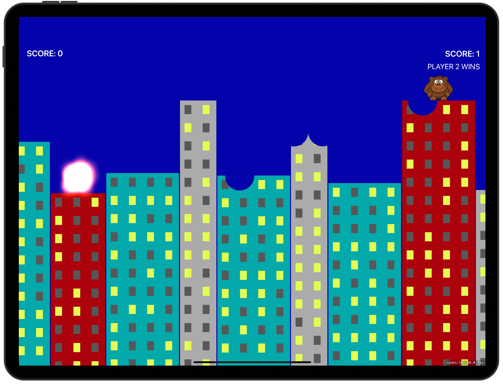
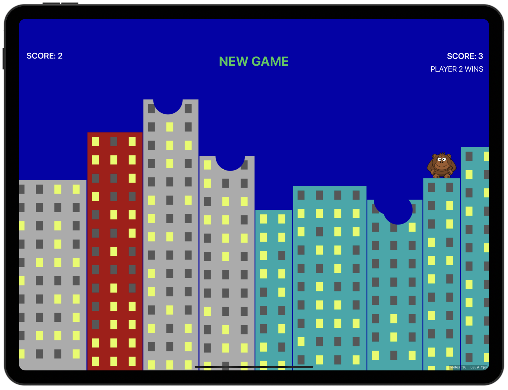

# Exploding Monkeys

[Project 29](https://www.hackingwithswift.com/read/29/overview) from the [100 Days of Swift course](https://www.hackingwithswift.com/100) by [Hacking With Swift](https://www.hackingwithswift.com/).

## Contents

|                      Day                      | Contents                                                                                                                                                                                                                                                                                                 |
|:---------------------------------------------:|:---------------------------------------------------------------------------------------------------------------------------------------------------------------------------------------------------------------------------------------------------------------------------------------------------------|
| [94](https://www.hackingwithswift.com/100/94) | <ul><li>[Setting up](https://www.hackingwithswift.com/read/29/1/setting-up)</li><li>[Building the environment: SKTexture and filling a path](https://www.hackingwithswift.com/read/29/2)</li><li>[Mixing UIKit and SpriteKit: UISlider and SKView](https://www.hackingwithswift.com/read/29/3)</li></ul> |
| [95](https://www.hackingwithswift.com/100/95) | <ul><li>[Unleash the bananas: SpriteKit texture atlases](https://www.hackingwithswift.com/read/29/4)</li><li>[Destructible terrain: presentScene](https://www.hackingwithswift.com/read/29/5)</li></ul>                                                                                                  | 
| [96](https://www.hackingwithswift.com/100/96) | <ul><li>[Wrap up](https://www.hackingwithswift.com/read/29/6/wrap-up)</li><li>[Review for Project 29: Exploding Monkeys](https://www.hackingwithswift.com/review/hws/project-29-exploding-monkeys)</li></ul>                                                                                             |

## I've learnt...

- Texture atlas: Set of pictures that are combined into a single image. It allows SpriteKit to draw lots of images without having to load and unload textures as it effectively just crops the big image as needed.
- `SKTransition` for navigating to a new scene. 
- Combining Core Graphics and physics to make, in this case, destructible terrain.
- The difference between `stride(from:through:by:)`, which counts up to and including the `through` parameter, and `stride(from:through:to:)`, which counts up to but excluding the `to` parameter.

## Challenges

Taken from [here](https://www.hackingwithswift.com/read/10/7/wrap-up):

**Note**: I have taken [this repository](https://github.com/clarknt/100-days-of-swift/blob/main/39-Project29/README.md) by GitHub user [clarknt](https://github.com/clarknt) as a reference to complete the 3rd challenge.

>- [x] Add code and UI to track the player scores across levels, then make the game end after one player has won three times.
>- [x] Add Auto Layout rules for the UI components in our storyboard, allowing them to remain positioned neatly regardless of which iPad size is used.
>- [x] Use the physics world’s gravity to add random wind to each level, making sure to add a label telling players the direction and strength.

## To do as a personal challenge...

- [x] Restructure the layout to make it more intuitive.
- [x] Fix bug in iOS 13 >= that causes the banana to not hit the building correctly.
- [ ] Try to fix a bug related with a SpriteKit's physics bug that happens when you slice a building in two. Only one half will respond to physics because it won't put two (now separate) physics bodies into one.

## Screenshots

