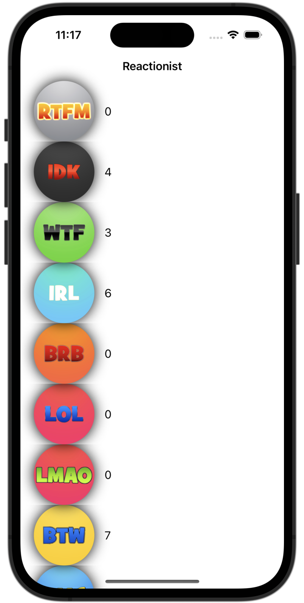

# Instruments

[Project 30](https://www.hackingwithswift.com/read/30/overview) from the [100 Days of Swift course](https://www.hackingwithswift.com/100) by [Hacking With Swift](https://www.hackingwithswift.com/).

## Contents

|                      Day                      | Contents                                                                                                                                                                                                                                                                                                                                                                                                                                |
|:---------------------------------------------:|:----------------------------------------------------------------------------------------------------------------------------------------------------------------------------------------------------------------------------------------------------------------------------------------------------------------------------------------------------------------------------------------------------------------------------------------|
| [97](https://www.hackingwithswift.com/100/97) | <ul><li>[Setting up](https://www.hackingwithswift.com/read/30/1/setting-up)</li><li>[What are we working with?](https://www.hackingwithswift.com/read/30/2)</li><li>[What can Instruments tell us?](https://www.hackingwithswift.com/read/30/3)</li><li>[Fixing the bugs: slow shadows](https://www.hackingwithswift.com/read/30/4)</li><li>[Fixing the bugs: wasted allocations](https://www.hackingwithswift.com/read/30/5)</li></ul> |
| [98](https://www.hackingwithswift.com/100/98) | <ul><li>[Fixing the bugs: Running out of memory](https://www.hackingwithswift.com/read/30/6)</li><li>[Wrap up](https://www.hackingwithswift.com/read/30/7/wrap-up)</li><li>[Review for Project 30: Instruments](https://www.hackingwithswift.com/review/hws/project-30-instruments)</li></ul>                                                                                                                                           |

## I've learnt...

- Fixing common problems related to cells of UITableView, Core Graphics and image rendering.
- Instruments in Xcode, which allows developers to measure various performance metrics of their app, including CPU usage, memory usage, network activity, and more, in real-time. (<key>⌘</key> + <key>I</key>)
- **Profiling**: The process of measuring the performance of an application or system in order to identify areas of inefficiency and improve its overall performance.
- Layer shadows
- Core Graphics' `clip()`: Draws things that lie inside the clipping path
- `UIImage(named:)` caches the image

## Challenges

Taken from [here](https://www.hackingwithswift.com/read/30/7/wrap-up):

>- [x] Go through project 30 and remove all the force unwraps. Note: implicitly unwrapped optionals are not the same thing as force unwraps – you’re welcome to fix the implicitly unwrapped optionals too, but that’s a bonus task.
>- [x] Pick any of the previous 29 projects that interests you, and try exploring it using the Allocations instrument. Can you find any objects that are persistent when they should have been destroyed?
>- [x] For a tougher challenge, take the image generation code out of `cellForRowAt:` generate all images when the app first launches, and use those smaller versions instead. For bonus points, combine the `getDocumentsDirectory()` method I introduced in project 10 so that you save the resulting cache to make sure it never happens again.

## Screenshots

  
  

