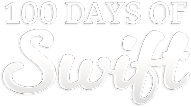

<!-- PROJECT SHIELDS -->
<!--
*** I am using markdown "reference style" links for readability.
*** Reference links are enclosed in brackets [ ] instead of parentheses ( ).
*** See the bottom of this document for the declaration of the reference variables
*** for contributors-url, forks-url, etc. This is an optional, concise syntax you may use.
*** https://www.markdownguide.org/basic-syntax/#reference-style-links
-->

<!-- PROJECT LOGO -->
 

    
    

        Compilation of all the projects (with challenges) and milestone projects carried out in the 100 Days of Swift course by Paul Hudson.
         
         
        
        
        
        
        
         
         
        <a href="https://github.com/HenestrosaConH/100-days-of-swift/issues/new/choose">Report Bug</a> · <a href="https://github.com/HenestrosaConH/100-days-of-swift/issues/new/choose">Request Feature</a> · <a href="https://github.com/HenestrosaConH/100-days-of-swift/discussions">Ask Question</a>
    

## Milestone Projects

### [1. World Flags](https://github.com/HenestrosaConH/100-days-of-swift/blob/main/MilestoneProjects/01-WorldFlags)

<table>
    <tr>
        <th>Day</th>
        <th>Contents</th>
        <th>Screenshots</th>
    </tr>
    <tr>
        <td><a href="https://www.hackingwithswift.com/100/23" target="_blank" rel="noopener">23</a></td>
        <td>
            <ul>
                <li><a href="https://www.hackingwithswift.com/guide/1/1" target="_blank" rel="noopener">What you learned</a></li>
                <li><a href="https://www.hackingwithswift.com/guide/1/2" target="_blank" rel="noopener">Key points</a></li>
                <li><a href="https://www.hackingwithswift.com/guide/1/3" target="_blank" rel="noopener">Challenge</a></li>
            </ul>
        </td>
        <td rowspan="3" align="center">
            
            
        </td>
    </tr>
</table>

 

### [2. Shopping List](https://github.com/HenestrosaConH/100-days-of-swift/blob/main/MilestoneProjects/02-ShoppingList)

<table>
    <tr>
        <th>Day</th>
        <th>Contents</th>
        <th>Screenshots</th>
    </tr>
    <tr>
        <td><a href="https://www.hackingwithswift.com/100/32" target="_blank" rel="noopener">32</a></td>
        <td>
            <ul>
                <li><a href="https://www.hackingwithswift.com/guide/2/1" target="_blank" rel="noopener">What you learned</a></li>
                <li><a href="https://www.hackingwithswift.com/guide/2/2" target="_blank" rel="noopener">Key points</a></li>
                <li><a href="https://www.hackingwithswift.com/guide/2/3" target="_blank" rel="noopener">Challenge</a></li>
            </ul>
        </td>
        <td rowspan="3" align="center">
            
            
        </td>
    </tr>
</table>

 

### [3. Hangman](https://github.com/HenestrosaConH/100-days-of-swift/blob/main/MilestoneProjects/03-Hangman)

<table>
    <tr>
        <th>Day</th>
        <th>Contents</th>
        <th>Screenshots</th>
    </tr>
    <tr>
        <td><a href="https://www.hackingwithswift.com/100/41" target="_blank" rel="noopener">32</a></td>
        <td>
            <ul>
                <li><a href="https://www.hackingwithswift.com/guide/3/1" target="_blank" rel="noopener">What you learned</a></li>
                <li><a href="https://www.hackingwithswift.com/guide/3/2" target="_blank" rel="noopener">Key points</a></li>
                <li><a href="https://www.hackingwithswift.com/guide/3/3" target="_blank" rel="noopener">Challenge</a></li>
            </ul>
        </td>
        <td rowspan="3" align="center">
            
            
            
            
        </td>
    </tr>
</table>

 

### [4. Photo Captions](https://github.com/HenestrosaConH/100-days-of-swift/blob/main/MilestoneProjects/04-PhotoCaptions)

<table>
    <tr>
        <th>Day</th>
        <th>Contents</th>
        <th>Screenshots</th>
    </tr>
    <tr>
        <td><a href="https://www.hackingwithswift.com/100/50" target="_blank" rel="noopener">50</a></td>
        <td>
            <ul>
                <li><a href="https://www.hackingwithswift.com/guide/4/1" target="_blank" rel="noopener">What you learned</a></li>
                <li><a href="https://www.hackingwithswift.com/guide/4/2" target="_blank" rel="noopener">Key points</a></li>
                <li><a href="https://www.hackingwithswift.com/guide/4/3" target="_blank" rel="noopener">Challenge</a></li>
            </ul>
        </td>
        <td rowspan="3" align="center">
            
            
            
        </td>
    </tr>
</table>

 

### [5. Country Facts](https://github.com/HenestrosaConH/100-days-of-swift/blob/main/MilestoneProjects/05-CountryFacts)

<table>
    <tr>
        <th>Day</th>
        <th>Contents</th>
        <th>Screenshots</th>
    </tr>
    <tr>
        <td><a href="https://www.hackingwithswift.com/100/59" target="_blank" rel="noopener">59</a></td>
        <td>
            <ul>
                <li><a href="https://www.hackingwithswift.com/guide/5/1" target="_blank" rel="noopener">What you learned</a></li>
                <li><a href="https://www.hackingwithswift.com/guide/5/2" target="_blank" rel="noopener">Key points</a></li>
                <li><a href="https://www.hackingwithswift.com/guide/5/3" target="_blank" rel="noopener">Challenge</a></li>
            </ul>
        </td>
        <td rowspan="3" align="center">
            
            
        </td>
    </tr>
</table>

 

### [6. Shooting Gallery](https://github.com/HenestrosaConH/100-days-of-swift/blob/main/MilestoneProjects/06-ShootingGallery)

<table>
    <tr>
        <th>Day</th>
        <th>Contents</th>
        <th>Screenshots</th>
    </tr>
    <tr>
        <td><a href="https://www.hackingwithswift.com/100/66" target="_blank" rel="noopener">66</a></td>
        <td>
            <ul>
                <li><a href="https://www.hackingwithswift.com/guide/6/1" target="_blank" rel="noopener">What you learned</a></li>
                <li><a href="https://www.hackingwithswift.com/guide/6/2" target="_blank" rel="noopener">Key points</a></li>
                <li><a href="https://www.hackingwithswift.com/guide/6/3" target="_blank" rel="noopener">Challenge</a></li>
            </ul>
        </td>
        <td rowspan="3" align="center">
            
            
            
        </td>
    </tr>
</table>

 

### [7. NotesClone](https://github.com/HenestrosaConH/100-days-of-swift/blob/main/MilestoneProjects/07-NotesClone)

<table>
    <tr>
        <th>Day</th>
        <th>Contents</th>
        <th>Screenshots</th>
    </tr>
    <tr>
        <td><a href="https://www.hackingwithswift.com/100/74" target="_blank" rel="noopener">74</a></td>
        <td>
            <ul>
                <li><a href="https://www.hackingwithswift.com/guide/7/1" target="_blank" rel="noopener">What you learned</a></li>
                <li><a href="https://www.hackingwithswift.com/guide/7/2" target="_blank" rel="noopener">Key points</a></li>
                <li><a href="https://www.hackingwithswift.com/guide/7/3" target="_blank" rel="noopener">Challenge</a></li>
            </ul>
        </td>
        <td rowspan="3" align="center">
            
            
        </td>
    </tr>
</table>

 

### [8. Extensions](https://github.com/HenestrosaConH/100-days-of-swift/blob/main/MilestoneProjects/08-Extensions)

<table>
    <tr>
        <th>Day</th>
        <th>Contents</th>
        <th>Screenshots</th>
    </tr>
    <tr>
        <td><a href="https://www.hackingwithswift.com/100/82" target="_blank" rel="noopener">82</a></td>
        <td>
            <ul>
                <li><a href="https://www.hackingwithswift.com/guide/8/1" target="_blank" rel="noopener">What you learned</a></li>
                <li><a href="https://www.hackingwithswift.com/guide/8/2" target="_blank" rel="noopener">Key points</a></li>
                <li><a href="https://www.hackingwithswift.com/guide/8/3" target="_blank" rel="noopener">Challenge</a></li>
            </ul>
        </td>
        <td rowspan="3" align="center">
            <em>No screenshots available for this project</em>
        </td>
    </tr>
</table>

 

### [9. Meme Generator](https://github.com/HenestrosaConH/100-days-of-swift/blob/main/MilestoneProjects/09-MemeGenerator)

<table>
    <tr>
        <th>Day</th>
        <th>Contents</th>
        <th>Screenshots</th>
    </tr>
    <tr>
        <td><a href="https://www.hackingwithswift.com/100/90" target="_blank" rel="noopener">90</a></td>
        <td>
            <ul>
                <li><a href="https://www.hackingwithswift.com/guide/9/1" target="_blank" rel="noopener">What you learned</a></li>
                <li><a href="https://www.hackingwithswift.com/guide/9/2" target="_blank" rel="noopener">Key points</a></li>
                <li><a href="https://www.hackingwithswift.com/guide/9/3" target="_blank" rel="noopener">Challenge</a></li>
            </ul>
        </td>
        <td rowspan="3" align="center">
            
            
        </td>
    </tr>
</table>

 

### [10. Memory Match](https://github.com/HenestrosaConH/100-days-of-swift/blob/main/MilestoneProjects/10-MemoryMatch)

<table>
    <tr>
        <th>Day</th>
        <th>Contents</th>
        <th>Screenshots</th>
    </tr>
    <tr>
        <td><a href="https://www.hackingwithswift.com/100/90" target="_blank" rel="noopener">99</a></td>
        <td>
            <ul>
                <li><a href="https://www.hackingwithswift.com/guide/9/1" target="_blank" rel="noopener">What you learned</a></li>
                <li><a href="https://www.hackingwithswift.com/guide/9/2" target="_blank" rel="noopener">Key points</a></li>
                <li><a href="https://www.hackingwithswift.com/guide/9/3" target="_blank" rel="noopener">Challenge</a></li>
            </ul>
        </td>
        <td rowspan="3" align="center">
            
            
            
        </td>
    </tr>
</table>

 

## Projects

**NOTES**:
- Click on the project's title to go to the project's code.
- There are only two screenshots per project in order to not bloat the main README. If you check any project's README, you will probably find more screenshots of that particular project.

### [1. Country Flags](https://github.com/HenestrosaConH/100-days-of-swift/blob/main/Projects/01-StormViewer)

<table>
    <tr>
        <th>Day</th>
        <th>Contents</th>
        <th>Screenshots</th>
    </tr>
    <tr>
        <td><a href="https://www.hackingwithswift.com/100/16" target="_blank" rel="noopener">16</a></td>
        <td>
            <ul>
                <li><a href="https://www.hackingwithswift.com/read/1/1" target="_blank" rel="noopener">Setting up</a></li>
                <li><a href="https://www.hackingwithswift.com/read/1/2" target="_blank" rel="noopener">Listing images with FileManager</a></li>
                <li><a href="https://www.hackingwithswift.com/read/1/3" target="_blank" rel="noopener">Designing our interface</a></li>
            </ul>
        </td>
        <td rowspan="3" align="center">
            
            
        </td>
    </tr>
    <tr>
        <td><a href="https://www.hackingwithswift.com/100/17" target="_blank" rel="noopener">17</a></td>
        <td>
            <ul>
                <li><a href="https://www.hackingwithswift.com/read/1/4" target="_blank" rel="noopener">Building a detail screen</a></li>
                <li><a href="https://www.hackingwithswift.com/read/1/5" target="_blank" rel="noopener">Loading images with UIImage</a></li>
                <li><a href="https://www.hackingwithswift.com/read/1/6" target="_blank" rel="noopener">Final tweaks: hidesBarsOnTap, safe area margins</a></li>
            </ul>
        </td>
    </tr>
    <tr>
        <td><a href="https://www.hackingwithswift.com/100/18" target="_blank" rel="noopener">18</a></td>
        <td>
            <ul>
                <li><a href="https://www.hackingwithswift.com/read/1/7" target="_blank" rel="noopener">Wrap up</a></li>
                <li><a href="https://www.hackingwithswift.com/review/hws/project-1-storm-viewer" target="_blank" rel="noopener">Review for Project 1: Storm Viewer</a></li>
            </ul>
        </td>
    </tr>
</table>

 

### [2. Guess the Flag](https://github.com/HenestrosaConH/100-days-of-swift/blob/main/Projects/02-GuessTheFlag)

<table>
    <tr>
        <th>Day</th>
        <th>Contents</th>
        <th>Screenshots</th>
    </tr>
    <tr>
        <td><a href="https://www.hackingwithswift.com/100/19" target="_blank" rel="noopener">19</a></td>
        <td>
            <ul>
                <li><a href="https://www.hackingwithswift.com/read/2/1" target="_blank" rel="noopener">Setting up</a></li>
                <li><a href="https://www.hackingwithswift.com/read/2/2" target="_blank" rel="noopener">Designing your layout</a></li>
                <li><a href="https://www.hackingwithswift.com/read/2/3" target="_blank" rel="noopener">Making the basic game work:  UIButton and CALayer</a></li>
            </ul>
        </td>
        <td rowspan="3" align="center">
            
            
        </td>
    </tr>
    <tr>
        <td><a href="https://www.hackingwithswift.com/100/20" target="_blank" rel="noopener">20</a></td>
        <td>
            <ul>
                <li><a href="https://www.hackingwithswift.com/read/2/4" target="_blank" rel="noopener">Guess which flag: random numbers</a></li>
                <li><a href="https://www.hackingwithswift.com/read/2/5" target="_blank" rel="noopener">From outlets to actions:  creating an IBAction</a></li>
            </ul>
        </td>
    </tr>
    <tr>
        <td><a href="https://www.hackingwithswift.com/100/21" target="_blank" rel="noopener">21</a></td>
        <td>
            <ul>
                <li><a href="https://www.hackingwithswift.com/read/2/6" target="_blank" rel="noopener">Wrap up</a></li>
                <li><a href="https://www.hackingwithswift.com/review/hws/project-2-guess-the-flag" target="_blank" rel="noopener">Review for Project 2: Guess the Flag</a></li>
            </ul>
        </td>
    </tr>
</table>

 

### [3. Social Media](https://github.com/HenestrosaConH/100-days-of-swift/blob/main/Projects/03-SocialMedia)

<table>
    <tr>
        <th>Day</th>
        <th>Contents</th>
        <th>Screenshots</th>
    </tr>
    <tr>
        <td><a href="https://www.hackingwithswift.com/100/22" target="_blank" rel="noopener">22</a></td>
        <td>
            <ul>
                <li><a href="https://www.hackingwithswift.com/read/3/1" target="_blank" rel="noopener">About technique projects</a></li>
                <li><a href="https://www.hackingwithswift.com/read/3/2" target="_blank" rel="noopener">UIActivityViewController explained</a></li>
                <li><a href="https://www.hackingwithswift.com/read/3/3" target="_blank" rel="noopener">Wrap up</a></li>
                <li><a href="https://www.hackingwithswift.com/review/hws/project-3-social-media" target="_blank" rel="noopener">Review for Project 3: Social media</a></li>
            </ul>
        </td>
        <td rowspan="3" align="center">
            
            
        </td>
    </tr>
</table>

 

### [4. Easy Browser](https://github.com/HenestrosaConH/100-days-of-swift/blob/main/Projects/04-EasyBrowser)

<table>
    <tr>
        <th>Day</th>
        <th>Contents</th>
        <th>Screenshots</th>
    </tr>
    <tr>
        <td><a href="https://www.hackingwithswift.com/100/24" target="_blank" rel="noopener">24</a></td>
        <td>
            <ul>
                <li><a href="https://www.hackingwithswift.com/read/4/1" target="_blank" rel="noopener">Setting up</a></li>
                <li><a href="https://www.hackingwithswift.com/read/4/2" target="_blank" rel="noopener">Creating a simple browser with WKWebView</a></li>
                <li><a href="https://www.hackingwithswift.com/read/4/3" target="_blank" rel="noopener">Choosing a website:  UIAlertController action sheets</a></li>
            </ul>
        </td>
        <td rowspan="3" align="center">
            
            
        </td>
    </tr>
    <tr>
        <td><a href="https://www.hackingwithswift.com/100/25" target="_blank" rel="noopener">25</a></td>
        <td>
            <ul>
                <li><a href="https://www.hackingwithswift.com/read/4/4" target="_blank" rel="noopener">Monitoring page loads:  UIToolbar and UIProgressView</a></li>
                <li><a href="https://www.hackingwithswift.com/read/4/5" target="_blank" rel="noopener">Refactoring for the win</a></li>
            </ul>
        </td>
    </tr>
    <tr>
        <td><a href="https://www.hackingwithswift.com/100/26" target="_blank" rel="noopener">26</a></td>
        <td>
            <ul>
                <li><a href="https://www.hackingwithswift.com/read/4/6" target="_blank" rel="noopener">Wrap up</a></li>
                <li><a href="https://www.hackingwithswift.com/review/hws/project-4-easy-browser" target="_blank" rel="noopener">Review for Project 4: Easy Browser</a></li>
            </ul>
        </td>
    </tr>
</table>

 

### [5. Word Scramble](https://github.com/HenestrosaConH/100-days-of-swift/blob/main/Projects/05-WordScramble)

<table>
    <tr>
        <th>Day</th>
        <th>Contents</th>
        <th>Screenshots</th>
    </tr>
    <tr>
        <td><a href="https://www.hackingwithswift.com/100/27" target="_blank" rel="noopener">27</a></td>
        <td>
            <ul>
                <li><a href="https://www.hackingwithswift.com/articles/179/capture-lists-in-swift-whats-the-difference-between-weak-strong-and-unowned-references1" target="_blank" rel="noopener">Capture lists in Swift  (unowned, weak and strong)</a></li>
                <li><a href="https://www.hackingwithswift.com/read/5/1" target="_blank" rel="noopener">Setting up</a></li>
                <li><a href="https://www.hackingwithswift.com/read/5/2" target="_blank" rel="noopener">Reading from disk: contentsOfFile</a></li>
                <li><a href="https://www.hackingwithswift.com/read/5/3" target="_blank" rel="noopener">Pick a word, any word: UIAlertController</a></li>
            </ul>
        </td>
        <td rowspan="3" align="center">
            
            
        </td>
    </tr>
    <tr>
        <td><a href="https://www.hackingwithswift.com/100/28" target="_blank" rel="noopener">28</a></td>
        <td>
            <ul>
                <li><a href="https://www.hackingwithswift.com/read/5/4" target="_blank" rel="noopener">Prepare for submission:  lowercased() and IndexPath</a></li>
                <li><a href="https://www.hackingwithswift.com/read/5/5" target="_blank" rel="noopener">Checking for valid answers</a></li>
                <li><a href="https://www.hackingwithswift.com/read/5/6" target="_blank" rel="noopener">Or else what?</a></li>
            </ul>
        </td>
    </tr>
    <tr>
        <td><a href="https://www.hackingwithswift.com/100/29" target="_blank" rel="noopener">29</a></td>
        <td>
            <ul>
                <li><a href="https://www.hackingwithswift.com/read/5/7" target="_blank" rel="noopener">Wrap up</a></li>
                <li><a href="https://www.hackingwithswift.com/review/hws/project-5-word-scramble" target="_blank" rel="noopener">Review for Project 5: Word Scramble</a></li>
            </ul>
        </td>
    </tr>
</table>

 

### [6. AutoLayout in Code](https://github.com/HenestrosaConH/100-days-of-swift/blob/main/Projects/06-AutoLayoutInCode)

<table>
    <tr>
        <th>Day</th>
        <th>Contents</th>
        <th>Screenshots</th>
    </tr>
    <tr>
        <td><a href="https://www.hackingwithswift.com/100/30" target="_blank" rel="noopener">30</a></td>
        <td>
            <ul>
                <li><a href="https://www.hackingwithswift.com/read/6/1" target="_blank" rel="noopener">Setting up</a></li>
                <li><a href="https://www.hackingwithswift.com/read/6/2" target="_blank" rel="noopener">Advanced Auto Layout</a></li>
                <li><a href="https://www.hackingwithswift.com/read/6/3" target="_blank" rel="noopener">Auto Layout in code: addConstraints() with Visual Format Language</a></li>
            </ul>
        </td>
        <td rowspan="3" align="center">
            
            
        </td>
    </tr>
    <tr>
        <td><a href="https://www.hackingwithswift.com/100/31" target="_blank" rel="noopener">31</a></td>
        <td>
            <ul>
                <li><a href="https://www.hackingwithswift.com/read/6/4" target="_blank" rel="noopener">Auto Layout metrics and priorities: constraints(withVisualFormat:)</a></li>
                <li><a href="https://www.hackingwithswift.com/read/6/5" target="_blank" rel="noopener">Auto Layout anchors</a></li>
                <li><a href="https://www.hackingwithswift.com/read/6/6" target="_blank" rel="noopener">Wrap up</a></li>
                <li><a href="https://www.hackingwithswift.com/review/hws/project-6-auto-layout" target="_blank" rel="noopener">Review for Project 6: Auto Layout</a></li>
            </ul>
        </td>
    </tr>
</table>

 

 

### [7. Whitehouse Petitions](https://github.com/HenestrosaConH/100-days-of-swift/blob/main/Projects/07-WhitehousePetitions)

<table>
    <tr>
        <th>Day</th>
        <th>Contents</th>
        <th>Screenshots</th>
    </tr>
    <tr>
        <td><a href="https://www.hackingwithswift.com/100/33" target="_blank" rel="noopener">33</a></td>
        <td>
            <ul>
                <li><a href="https://www.hackingwithswift.com/read/7/1" target="_blank" rel="noopener">Setting up</a></li>
                <li><a href="https://www.hackingwithswift.com/read/7/2" target="_blank" rel="noopener">Creating the basic UI: UITabBarController</a></li>
                <li><a href="https://www.hackingwithswift.com/read/7/3" target="_blank" rel="noopener">Parsing JSON using the Codable protocol</a></li>
            </ul>
        </td>
        <td rowspan="3" align="center">
            
            
        </td>
    </tr>
    <tr>
        <td><a href="https://www.hackingwithswift.com/100/34" target="_blank" rel="noopener">34</a></td>
        <td>
            <ul>
                <li><a href="https://www.hackingwithswift.com/read/7/4" target="_blank" rel="noopener">Rendering a petition: loadHTMLString</a></li>
                <li><a href="https://www.hackingwithswift.com/read/7/5" target="_blank" rel="noopener">Finishing touches:  didFinishLaunchingWithOptions</a></li>
            </ul>
        </td>
    </tr>
    <tr>
        <td><a href="https://www.hackingwithswift.com/100/35" target="_blank" rel="noopener">35</a></td>
        <td>
            <ul>
                <li><a href="https://www.hackingwithswift.com/read/7/6" target="_blank" rel="noopener">Wrap up</a></li>
                <li><a href="https://www.hackingwithswift.com/review/hws/project-7-whitehouse-petitions" target="_blank" rel="noopener">Review for Project 7: Whitehouse Petitions</a></li>
            </ul>
        </td>
    </tr>
</table>

 

### [8. Seven Swifty Words](https://github.com/HenestrosaConH/100-days-of-swift/blob/main/Projects/08-SevenSwiftyWords)

<table>
    <tr>
        <th>Day</th>
        <th>Contents</th>
        <th>Screenshots</th>
    </tr>
    <tr>
        <td><a href="https://www.hackingwithswift.com/100/36" target="_blank" rel="noopener">36</a></td>
        <td>
            <ul>
                <li><a href="https://www.hackingwithswift.com/read/8/1" target="_blank" rel="noopener">Setting up</a></li>
                <li><a href="https://www.hackingwithswift.com/read/8/2" target="_blank" rel="noopener">Building a UIKit user interface programmatically</a></li>
            </ul>
        </td>
        <td rowspan="3" align="center">
            
        </td>
    </tr>
    <tr>
        <td><a href="https://www.hackingwithswift.com/100/37" target="_blank" rel="noopener">37</a></td>
        <td>
            <ul>
                <li><a href="https://www.hackingwithswift.com/read/8/3" target="_blank" rel="noopener">Loading a level and adding button targets</a></li>
                <li><a href="https://www.hackingwithswift.com/read/8/4" target="_blank" rel="noopener">It's play time: firstIndex(of:) and joined()</a></li>
                <li><a href="https://www.hackingwithswift.com/read/8/5" target="_blank" rel="noopener">Property observers: didSet</a></li>
            </ul>
        </td>
    </tr>
    <tr>
        <td><a href="https://www.hackingwithswift.com/100/38" target="_blank" rel="noopener">38</a></td>
        <td>
            <ul>
                <li><a href="https://www.hackingwithswift.com/read/8/6" target="_blank" rel="noopener">Wrap up</a></li>
                <li><a href="https://www.hackingwithswift.com/review/hws/project-8-7-swifty-words" target="_blank" rel="noopener">Review for Project 8: Seven Swifty Words</a></li>
            </ul>
        </td>
    </tr>
</table>

 

### [9. Whitehouse Petitions Async](https://github.com/HenestrosaConH/100-days-of-swift/blob/main/Projects/09-WhitehousePetitionsAsync)

<table>
    <tr>
        <th>Day</th>
        <th>Contents</th>
        <th>Screenshots</th>
    </tr>
    <tr>
        <td><a href="https://www.hackingwithswift.com/100/39" target="_blank" rel="noopener">39</a></td>
        <td>
            <ul>
                <li><a href="https://www.hackingwithswift.com/read/9/1" target="_blank" rel="noopener">Setting up</a></li>
                <li><a href="https://www.hackingwithswift.com/read/9/2" target="_blank" rel="noopener">Why is locking the UI bad?</a></li>
                <li><a href="https://www.hackingwithswift.com/read/9/3" target="_blank" rel="noopener">GCD 101: async()</a></li>
                <li><a href="https://www.hackingwithswift.com/read/9/4" target="_blank" rel="noopener">Back to the main thread: DispatchQueue.main</a></li>
                <li><a href="https://www.hackingwithswift.com/read/9/5" target="_blank" rel="noopener">Easy GCD using performSelector(inBackground:)</a></li>
            </ul>
        </td>
        <td rowspan="3" align="center">
            
            
        </td>
    </tr>
    <tr>
        <td><a href="https://www.hackingwithswift.com/100/40" target="_blank" rel="noopener">40</a></td>
        <td>
            <ul>
                <li><a href="https://www.hackingwithswift.com/read/9/6" target="_blank" rel="noopener">Wrap up</a></li>
                <li><a href="https://www.hackingwithswift.com/review/hws/project-9-grand-central-dispatch" target="_blank" rel="noopener">Review for Project 9: Grand Central Dispatch</a></li>
            </ul>
        </td>
    </tr>
</table>

 

### [10. Names to Faces](https://github.com/HenestrosaConH/100-days-of-swift/blob/main/Projects/10-NamesToFaces)

<table>
    <tr>
        <th>Day</th>
        <th>Contents</th>
        <th>Screenshots</th>
    </tr>
    <tr>
        <td><a href="https://www.hackingwithswift.com/100/42" target="_blank" rel="noopener">42</a></td>
        <td>
            <ul>
                <li><a href="https://www.hackingwithswift.com/read/10/1" target="_blank" rel="noopener">Setting up</a></li>
                <li><a href="https://www.hackingwithswift.com/read/10/2" target="_blank" rel="noopener">Designing UICollectionView cells</a></li>
                <li><a href="https://www.hackingwithswift.com/read/10/3" target="_blank" rel="noopener">UICollectionView data sources</a></li>
            </ul>
        </td>
        <td rowspan="3" align="center">
            
            
        </td>
    </tr>
    <tr>
        <td><a href="https://www.hackingwithswift.com/100/43" target="_blank" rel="noopener">43</a></td>
        <td>
            <ul>
                <li><a href="https://www.hackingwithswift.com/read/10/4" target="_blank" rel="noopener">Importing photos with UIImagePickerController</a></li>
                <li><a href="https://www.hackingwithswift.com/read/10/5" target="_blank" rel="noopener">Custom subclasses of NSObject</a></li>
                <li><a href="https://www.hackingwithswift.com/read/10/6" target="_blank" rel="noopener">Connecting up the people</a></li>
            </ul>
        </td>
    </tr>
    <tr>
        <td><a href="https://www.hackingwithswift.com/100/44" target="_blank" rel="noopener">44</a></td>
        <td>
            <ul>
                <li><a href="https://www.hackingwithswift.com/read/10/7" target="_blank" rel="noopener">Wrap up</a></li>
                <li><a href="https://www.hackingwithswift.com/review/hws/project-10-names-to-faces" target="_blank" rel="noopener">Review for Project 10: Names To Faces</a></li>
            </ul>
        </td>
    </tr>
</table>

 

### [11. Pachinko](https://github.com/HenestrosaConH/100-days-of-swift/blob/main/Projects/11-Pachinko)

<table>
    <tr>
        <th>Day</th>
        <th>Contents</th>
        <th>Screenshots</th>
    </tr>
    <tr>
        <td><a href="https://www.hackingwithswift.com/100/45" target="_blank" rel="noopener">45</a></td>
        <td>
            <ul>
                <li><a href="https://www.hackingwithswift.com/read/11/1" target="_blank" rel="noopener">Setting up</a></li>
                <li><a href="https://www.hackingwithswift.com/read/11/2" target="_blank" rel="noopener">Falling boxes: SKSpriteNode, UITouch, SKPhysicsBody</a></li>
                <li><a href="https://www.hackingwithswift.com/read/11/3" target="_blank" rel="noopener">Bouncing balls: circleOfRadius</a></li>
            </ul>
        </td>
        <td rowspan="3" align="center">
            
        </td>
    </tr>
    <tr>
        <td><a href="https://www.hackingwithswift.com/100/46" target="_blank" rel="noopener">46</a></td>
        <td>
            <ul>
                <li><a href="https://www.hackingwithswift.com/read/11/4" target="_blank" rel="noopener">Spinning slots: SKAction</a></li>
                <li><a href="https://www.hackingwithswift.com/read/11/5" target="_blank" rel="noopener">Collision detection: SKPhysicsContactDelegate</a></li>
                <li><a href="https://www.hackingwithswift.com/read/11/6" target="_blank" rel="noopener">Scores on the board: SKLabelNode</a></li>
            </ul>
        </td>
    </tr>
    <tr>
        <td><a href="https://www.hackingwithswift.com/100/47" target="_blank" rel="noopener">47</a></td>
        <td>
            <ul>
                <li><a href="https://www.hackingwithswift.com/read/11/7" target="_blank" rel="noopener">Special effects: SKEmitterNode</a></li>                
                <li><a href="https://www.hackingwithswift.com/read/11/8" target="_blank" rel="noopener">Wrap up</a></li>
                <li><a href="https://www.hackingwithswift.com/review/hws/project-11-pachinko" target="_blank" rel="noopener">Review for Project 11: Pachinko</a></li>
            </ul>
        </td>
    </tr>
</table>

 

### [12. UserDefaults](https://github.com/HenestrosaConH/100-days-of-swift/blob/main/Projects/12-UserDefaults)

<table>
    <tr>
        <th>Day</th>
        <th>Contents</th>
        <th>Screenshots</th>
    </tr>
    <tr>
        <td><a href="https://www.hackingwithswift.com/100/48" target="_blank" rel="noopener">48</a></td>
        <td>
            <ul>
                <li><a href="https://www.hackingwithswift.com/read/12/1" target="_blank" rel="noopener">Setting up</a></li>
                <li><a href="https://www.hackingwithswift.com/read/12/2" target="_blank" rel="noopener">Reading and writing basics: UserDefaults</a></li>
                <li><a href="https://www.hackingwithswift.com/read/12/3" target="_blank" rel="noopener">Fixing Project 10: NSCoding</a></li>
            </ul>
        </td>
        <td rowspan="3" align="center">
            
            
        </td>
    </tr>
    <tr>
        <td><a href="https://www.hackingwithswift.com/100/49" target="_blank" rel="noopener">49</a></td>
        <td>
            <ul>
                <li><a href="https://www.hackingwithswift.com/read/12/4" target="_blank" rel="noopener">Fixing Project 10: Codable</a></li>
                <li><a href="https://www.hackingwithswift.com/read/12/5" target="_blank" rel="noopener">Wrap up</a></li>
                <li><a href="https://www.hackingwithswift.com/review/hws/project-12-userdefaults" target="_blank" rel="noopener">Review for Project 12: UserDefaults</a></li>
            </ul>
        </td>
    </tr>
</table>

 

### [13. InstaFilter](https://github.com/HenestrosaConH/100-days-of-swift/blob/main/Projects/13-InstaFilter)

<table>
    <tr>
        <th>Day</th>
        <th>Contents</th>
        <th>Screenshots</th>
    </tr>
    <tr>
        <td><a href="https://www.hackingwithswift.com/100/52" target="_blank" rel="noopener">52</a></td>
        <td>
            <ul>
                <li><a href="https://www.hackingwithswift.com/read/13/1" target="_blank" rel="noopener">Setting up</a></li>
                <li><a href="https://www.hackingwithswift.com/read/13/2" target="_blank" rel="noopener">Designing the interface</a></li>
                <li><a href="https://www.hackingwithswift.com/read/13/3" target="_blank" rel="noopener">Importing a picture</a></li>
            </ul>
        </td>
        <td rowspan="3" align="center">
            
            
        </td>
    </tr>
    <tr>
        <td><a href="https://www.hackingwithswift.com/100/53" target="_blank" rel="noopener">53</a></td>
        <td>
            <ul>
                <li><a href="https://www.hackingwithswift.com/read/13/4" target="_blank" rel="noopener">Applying filters: CIContext, CIFilter</a></li>
                <li><a href="https://www.hackingwithswift.com/read/13/5" target="_blank" rel="noopener">Saving to the iOS photo library</a></li>
            </ul>
        </td>
    </tr>
    <tr>
        <td><a href="https://www.hackingwithswift.com/100/54" target="_blank" rel="noopener">54</a></td>
        <td>
            <ul>
                <li><a href="https://www.hackingwithswift.com/read/13/6" target="_blank" rel="noopener">Wrap up</a></li>
                <li><a href="https://www.hackingwithswift.com/review/hws/project-13-instafilter" target="_blank" rel="noopener">Review for Project 13: InstaFilter</a></li>
            </ul>
        </td>
    </tr>
</table>

 

### [14. Whack-a-Penguin](https://github.com/HenestrosaConH/100-days-of-swift/blob/main/Projects/14-WhackAPenguin)

<table>
    <tr>
        <th>Day</th>
        <th>Contents</th>
        <th>Screenshots</th>
    </tr>
    <tr>
        <td><a href="https://www.hackingwithswift.com/100/55" target="_blank" rel="noopener">55</a></td>
        <td>
            <ul>
                <li><a href="https://www.hackingwithswift.com/read/14/1" target="_blank" rel="noopener">Setting up</a></li>
                <li><a href="https://www.hackingwithswift.com/read/14/2" target="_blank" rel="noopener">Getting up and running: SKCropNode</a></li>
                <li><a href="https://www.hackingwithswift.com/read/14/3" target="_blank" rel="noopener">Penguin, show thyself: SKAction moveBy(x:y:duration:)</a></li>
            </ul>
        </td>
        <td rowspan="3" align="center">
            
            
        </td>
    </tr>
    <tr>
        <td><a href="https://www.hackingwithswift.com/100/56" target="_blank" rel="noopener">56</a></td>
        <td>
            <ul>
                <li><a href="https://www.hackingwithswift.com/read/14/4" target="_blank" rel="noopener">Whack to win: SKAction sequences</a></li>
                <li><a href="https://www.hackingwithswift.com/read/14/5" target="_blank" rel="noopener">Wrap up</a></li>
                <li><a href="https://www.hackingwithswift.com/review/hws/project-14-whack-a-penguin" target="_blank" rel="noopener">Review for Project 14: Whack-a-Penguin</a></li>
            </ul>
        </td>
    </tr>
</table>

 

### [15. Animation](https://github.com/HenestrosaConH/100-days-of-swift/blob/main/Projects/15-Animation)

<table>
    <tr>
        <th>Day</th>
        <th>Contents</th>
        <th>Screenshots</th>
    </tr>
    <tr>
        <td><a href="https://www.hackingwithswift.com/100/57" target="_blank" rel="noopener">57</a></td>
        <td>
            <ul>
                <li><a href="https://www.hackingwithswift.com/read/15/1" target="_blank" rel="noopener">Setting up</a></li>
                <li><a href="https://www.hackingwithswift.com/read/15/2" target="_blank" rel="noopener">Preparing for action</a></li>
                <li><a href="https://www.hackingwithswift.com/read/15/3" target="_blank" rel="noopener">Switch, case, animate: animate(withDuration:)</a></li>
                <li><a href="https://www.hackingwithswift.com/read/15/4" target="_blank" rel="noopener">Transform: CGAffineTransform</a></li>
            </ul>
        </td>
        <td rowspan="3" align="center">
            
        </td>
    </tr>
    <tr>
        <td><a href="https://www.hackingwithswift.com/100/58" target="_blank" rel="noopener">58</a></td>
        <td>
            <ul>
                <li><a href="https://www.hackingwithswift.com/read/15/6" target="_blank" rel="noopener">Wrap up</a></li>
                <li><a href="https://www.hackingwithswift.com/review/hws/project-15-animation" target="_blank" rel="noopener">Review for Project 15: Animation</a></li>
            </ul>
        </td>
    </tr>
</table>

 

### [16. Capital Cities](https://github.com/HenestrosaConH/100-days-of-swift/blob/main/Projects/16-CapitalCities)

<table>
    <tr>
        <th>Day</th>
        <th>Contents</th>
        <th>Screenshots</th>
    </tr>
    <tr>
        <td><a href="https://www.hackingwithswift.com/100/60" target="_blank" rel="noopener">60</a></td>
        <td>
            <ul>
                <li><a href="https://www.hackingwithswift.com/read/16/1" target="_blank" rel="noopener">Setting up</a></li>
                <li><a href="https://www.hackingwithswift.com/read/16/2" target="_blank" rel="noopener">Up and running with MapKit</a></li>
                <li><a href="https://www.hackingwithswift.com/read/16/3" target="_blank" rel="noopener">Annotations and accessory views:  MKPinAnnotationView</a></li>
            </ul>
        </td>
        <td rowspan="3" align="center">
            
            
        </td>
    </tr>
    <tr>
        <td><a href="https://www.hackingwithswift.com/100/61" target="_blank" rel="noopener">61</a></td>
        <td>
            <ul>
                <li><a href="https://www.hackingwithswift.com/read/16/4" target="_blank" rel="noopener">Wrap up</a></li>
                <li><a href="https://www.hackingwithswift.com/review/hws/project-16-capital-cities" target="_blank" rel="noopener">Review for Project 16: Capital Cities</a></li>
            </ul>
        </td>
    </tr>
</table>

 

### [17. Space Race](https://github.com/HenestrosaConH/100-days-of-swift/blob/main/Projects/17-SpaceRace)

<table>
    <tr>
        <th>Day</th>
        <th>Contents</th>
        <th>Screenshots</th>
    </tr>
    <tr>
        <td><a href="https://www.hackingwithswift.com/100/62" target="_blank" rel="noopener">62</a></td>
        <td>
            <ul>
                <li><a href="https://www.hackingwithswift.com/read/17/1" target="_blank" rel="noopener">Setting up</a></li>
                <li><a href="https://www.hackingwithswift.com/read/17/2" target="_blank" rel="noopener">Space: the final frontier</a></li>
                <li><a href="https://www.hackingwithswift.com/read/17/3" target="_blank" rel="noopener">Bring on the enemies:  linearDamping, angularDamping</a></li>
                <li><a href="https://www.hackingwithswift.com/read/17/4" target="_blank" rel="noopener">Making contact: didBegin()</a></li>
            </ul>
        </td>
        <td rowspan="3" align="center">
            
            
        </td>
    </tr>
    <tr>
        <td><a href="https://www.hackingwithswift.com/100/63" target="_blank" rel="noopener">63</a></td>
        <td>
            <ul>
                <li><a href="https://www.hackingwithswift.com/read/17/5" target="_blank" rel="noopener">Wrap up</a></li>
                <li><a href="https://www.hackingwithswift.com/review/hws/project-17-space-race" target="_blank" rel="noopener">Review for Project 17: Space Race</a></li>
            </ul>
        </td>
    </tr>
</table>

 

### [18. Debugging](https://github.com/HenestrosaConH/100-days-of-swift/blob/main/Projects/18-Debugging)

<table>
    <tr>
        <th>Day</th>
        <th>Contents</th>
        <th>Screenshots</th>
    </tr>
    <tr>
        <td><a href="https://www.hackingwithswift.com/100/64" target="_blank" rel="noopener">64</a></td>
        <td>
            <ul>
                <li><a href="https://www.hackingwithswift.com/read/18/1" target="_blank" rel="noopener">Setting up</a></li>
                <li><a href="https://www.hackingwithswift.com/read/18/2" target="_blank" rel="noopener">Basic Swift debugging using print()</a></li>
                <li><a href="https://www.hackingwithswift.com/read/18/3" target="_blank" rel="noopener">Debugging with assert()</a></li>
                <li><a href="https://www.hackingwithswift.com/read/18/4" target="_blank" rel="noopener">Debugging with breakpoints</a></li>
                <li><a href="https://www.hackingwithswift.com/read/18/5" target="_blank" rel="noopener">View debugging</a></li>
            </ul>
        </td>
        <td rowspan="3" align="center">
            <em>No screenshots available for this project</em>
        </td>
    </tr>
    <tr>
        <td><a href="https://www.hackingwithswift.com/100/65" target="_blank" rel="noopener">65</a></td>
        <td>
            <ul>
                <li><a href="https://www.hackingwithswift.com/read/18/6" target="_blank" rel="noopener">Wrap up</a></li>
                <li><a href="https://www.hackingwithswift.com/review/hws/project-18-debugging" target="_blank" rel="noopener">Review for Project 18: Debugging</a></li>
            </ul>
        </td>
    </tr>
</table>

 

### [19. JavaScript Injection](https://github.com/HenestrosaConH/100-days-of-swift/blob/main/Projects/19-JavaScriptInjection)

<table>
    <tr>
        <th>Day</th>
        <th>Contents</th>
        <th>Screenshots</th>
    </tr>
    <tr>
        <td><a href="https://www.hackingwithswift.com/100/67" target="_blank" rel="noopener">67</a></td>
        <td>
            <ul>
                <li><a href="https://www.hackingwithswift.com/read/18/1" target="_blank" rel="noopener">Setting up</a></li>
                <li><a href="https://www.hackingwithswift.com/read/18/2" target="_blank" rel="noopener">Making a shell app</a></li>
                <li><a href="https://www.hackingwithswift.com/read/18/3" target="_blank" rel="noopener">Adding an extension: NSExtensionItem</a></li>
                <li><a href="https://www.hackingwithswift.com/read/18/4" target="_blank" rel="noopener">What do you want to get?</a></li>
            </ul>
        </td>
        <td rowspan="3" align="center">
            
            
        </td>
    </tr>
    <tr>
        <td><a href="https://www.hackingwithswift.com/100/68" target="_blank" rel="noopener">68</a></td>
        <td>
            <ul>
                <li><a href="https://www.hackingwithswift.com/read/18/5" target="_blank" rel="noopener">Establishing communication</a></li>
                <li><a href="https://www.hackingwithswift.com/read/18/6" target="_blank" rel="noopener">Editing multiline text with UITextView</a></li>
                <li><a href="https://www.hackingwithswift.com/read/18/7" target="_blank" rel="noopener">Fixing the keyboard: NotificationCenter</a></li>
            </ul>
        </td>
    </tr>
    <tr>
        <td><a href="https://www.hackingwithswift.com/100/69" target="_blank" rel="noopener">69</a></td>
        <td>
            <ul>
                <li><a href="https://www.hackingwithswift.com/read/19/8" target="_blank" rel="noopener">Wrap up</a></li>
                <li><a href="https://www.hackingwithswift.com/review/hws/project-19-javascript-injection" target="_blank" rel="noopener">Review for Project 19: JavaScript Injection</a></li>
            </ul>
        </td>
    </tr>
</table>

 

### [20. Fireworks Night](https://github.com/HenestrosaConH/100-days-of-swift/blob/main/Projects/20-FireworksNight)

<table>
    <tr>
        <th>Day</th>
        <th>Contents</th>
        <th>Screenshots</th>
    </tr>
    <tr>
        <td><a href="https://www.hackingwithswift.com/100/70" target="_blank" rel="noopener">70</a></td>
        <td>
            <ul>
                <li><a href="https://www.hackingwithswift.com/read/20/1" target="_blank" rel="noopener">Setting up</a></li>
                <li><a href="https://www.hackingwithswift.com/read/20/2" target="_blank" rel="noopener">Ready... aim... fire: Timer and follow()</a></li>
                <li><a href="https://www.hackingwithswift.com/read/20/3" target="_blank" rel="noopener">Swipe to select</a></li>
            </ul>
        </td>
        <td rowspan="3" align="center">
            
            
        </td>
    </tr>
    <tr>
        <td><a href="https://www.hackingwithswift.com/100/71" target="_blank" rel="noopener">71</a></td>
        <td>
            <ul>
                <li><a href="https://www.hackingwithswift.com/read/20/4" target="_blank" rel="noopener">Making things go bang: SKEmitterNode</a></li>
                <li><a href="https://www.hackingwithswift.com/read/20/5" target="_blank" rel="noopener">Wrap up</a></li>
                <li><a href="https://www.hackingwithswift.com/review/hws/project-20-fireworks-night" target="_blank" rel="noopener">Review for Project 20: Fireworks Night</a></li>
            </ul>
        </td>
    </tr>
</table>

 

### [21. Local Notifications](https://github.com/HenestrosaConH/100-days-of-swift/blob/main/Projects/21-LocalNotifications)

<table>
    <tr>
        <th>Day</th>
        <th>Contents</th>
        <th>Screenshots</th>
    </tr>
    <tr>
        <td><a href="https://www.hackingwithswift.com/100/72" target="_blank" rel="noopener">72</a></td>
        <td>
            <ul>
                <li><a href="https://www.hackingwithswift.com/read/21/1" target="_blank" rel="noopener">Setting up</a></li>
                <li><a href="https://www.hackingwithswift.com/read/21/2" target="_blank" rel="noopener">Scheduling notifications:  UNUserNotificationsCenter   and UNNotificationRequest</a></li>
                <li><a href="https://www.hackingwithswift.com/read/21/3" target="_blank" rel="noopener">Acting on responses</a></li>
            </ul>
        </td>
        <td rowspan="3" align="center">
            
            
        </td>
    </tr>
    <tr>
        <td><a href="https://www.hackingwithswift.com/100/73" target="_blank" rel="noopener">73</a></td>
        <td>
            <ul>
                <li><a href="https://www.hackingwithswift.com/read/21/4" target="_blank" rel="noopener">Wrap up</a></li>
                <li><a href="https://www.hackingwithswift.com/review/hws/project-21-local-notification" target="_blank" rel="noopener">Review for Project 21: Local Notifications</a></li>
            </ul>
        </td>
    </tr>
</table>

 

### [22. Detect-a-Beacon](https://github.com/HenestrosaConH/100-days-of-swift/blob/main/Projects/22-DetectABeacon)

<table>
    <tr>
        <th>Day</th>
        <th>Contents</th>
        <th>Screenshots</th>
    </tr>
    <tr>
        <td><a href="https://www.hackingwithswift.com/100/75" target="_blank" rel="noopener">75</a></td>
        <td>
            <ul>
                <li><a href="https://www.hackingwithswift.com/read/22/1" target="_blank" rel="noopener">Setting up</a></li>
                <li><a href="https://www.hackingwithswift.com/read/22/2" target="_blank" rel="noopener">Requesting location: Core Location</a></li>
                <li><a href="https://www.hackingwithswift.com/read/22/3" target="_blank" rel="noopener">Hunting the beacon: CLBeaconRegion</a></li>
            </ul>
        </td>
        <td rowspan="3" align="center">
            
            
        </td>
    </tr>
    <tr>
        <td><a href="https://www.hackingwithswift.com/100/76" target="_blank" rel="noopener">76</a></td>
        <td>
            <ul>
                <li><a href="https://www.hackingwithswift.com/read/22/4" target="_blank" rel="noopener">Wrap up</a></li>
                <li><a href="https://www.hackingwithswift.com/review/hws/project-22-detect-a-beacon" target="_blank" rel="noopener">Review for Project 22: Detect-a-Beacon</a></li>
            </ul>
        </td>
    </tr>
</table>

 

### [23. Swifty Ninja](https://github.com/HenestrosaConH/100-days-of-swift/blob/main/Projects/23-SwiftyNinja)

<table>
    <tr>
        <th>Day</th>
        <th>Contents</th>
        <th>Screenshots</th>
    </tr>
    <tr>
        <td><a href="https://www.hackingwithswift.com/100/77" target="_blank" rel="noopener">77</a></td>
        <td>
            <ul>
                <li><a href="https://www.hackingwithswift.com/read/23/1" target="_blank" rel="noopener">Setting up</a></li>
                <li><a href="https://www.hackingwithswift.com/read/23/2" target="_blank" rel="noopener">Basics quick start: SKShapeNode</a></li>
                <li><a href="https://www.hackingwithswift.com/read/23/3" target="_blank" rel="noopener">Shaping up for action: CGPath and UIBezierPath</a></li>
                <li><a href="https://www.hackingwithswift.com/read/23/4" target="_blank" rel="noopener">Enemy or bomb: AVAudioPlayer</a></li>
            </ul>
        </td>
        <td rowspan="3" align="center">
            
            
        </td>
    </tr>
    <tr>
        <td><a href="https://www.hackingwithswift.com/100/78" target="_blank" rel="noopener">78</a></td>
        <td>
            <ul>
                <li><a href="https://www.hackingwithswift.com/read/23/5" target="_blank" rel="noopener">Follow the sequence</a></li>
                <li><a href="https://www.hackingwithswift.com/read/23/6" target="_blank" rel="noopener">Slice to win</a></li>
                <li><a href="https://www.hackingwithswift.com/read/23/7" target="_blank" rel="noopener">Game over, man: SKTexture</a></li>
            </ul>
        </td>
    </tr>
    <tr>
        <td><a href="https://www.hackingwithswift.com/100/79" target="_blank" rel="noopener">79</a></td>
        <td>
            <ul>
                <li><a href="https://www.hackingwithswift.com/read/23/8" target="_blank" rel="noopener">Wrap up</a></li>
                <li><a href="https://www.hackingwithswift.com/review/hws/project-23-swifty-ninja" target="_blank" rel="noopener">Review for Project 23: Swifty Ninja</a></li>
            </ul>
        </td>
    </tr>
</table>

 

### [24. Swift Strings](https://github.com/HenestrosaConH/100-days-of-swift/blob/main/Projects/24-SwiftStrings)

<table>
    <tr>
        <th>Day</th>
        <th>Contents</th>
        <th>Screenshots</th>
    </tr>
    <tr>
        <td><a href="https://www.hackingwithswift.com/100/80" target="_blank" rel="noopener">80</a></td>
        <td>
            <ul>
                <li><a href="https://www.hackingwithswift.com/read/24/1" target="_blank" rel="noopener">Setting up</a></li>
                <li><a href="https://www.hackingwithswift.com/read/24/2" target="_blank" rel="noopener">Strings are not arrays</a></li>
                <li><a href="https://www.hackingwithswift.com/read/24/3" target="_blank" rel="noopener">Working with strings in Swift</a></li>
                <li><a href="https://www.hackingwithswift.com/read/24/4" target="_blank" rel="noopener">Formatting strings with NSAttributedString</a></li>
            </ul>
        </td>
        <td rowspan="3" align="center">
            <em>No screenshots available for this project</em>
        </td>
    </tr>
    <tr>
        <td><a href="https://www.hackingwithswift.com/100/81" target="_blank" rel="noopener">81</a></td>
        <td>
            <ul>
                <li><a href="https://www.hackingwithswift.com/read/24/5" target="_blank" rel="noopener">Wrap up</a></li>
                <li><a href="https://www.hackingwithswift.com/review/hws/project-24-swift-strings" target="_blank" rel="noopener">Review for Project 24: Swift Strings</a></li>
            </ul>
        </td>
    </tr>
</table>

 

### [25. Selfie Share](https://github.com/HenestrosaConH/100-days-of-swift/blob/main/Projects/25-SelfieShare)

<table>
    <tr>
        <th>Day</th>
        <th>Contents</th>
        <th>Screenshots</th>
    </tr>
    <tr>
        <td><a href="https://www.hackingwithswift.com/100/83" target="_blank" rel="noopener">83</a></td>
        <td>
            <ul>
                <li><a href="https://www.hackingwithswift.com/read/24/1" target="_blank" rel="noopener">Setting up</a></li>
                <li><a href="https://www.hackingwithswift.com/read/24/2" target="_blank" rel="noopener">Importing photos again</a></li>
                <li><a href="https://www.hackingwithswift.com/read/24/3" target="_blank" rel="noopener">Going peer to peer  MCSession,  MCBrowserViewController</a></li>
                <li><a href="https://www.hackingwithswift.com/read/24/4" target="_blank" rel="noopener">Invitation only: MCPeerID</a></li>
            </ul>
        </td>
        <td rowspan="3" align="center">
            
            
        </td>
    </tr>
    <tr>
        <td><a href="https://www.hackingwithswift.com/100/84" target="_blank" rel="noopener">84</a></td>
        <td>
            <ul>
                <li><a href="https://www.hackingwithswift.com/read/25/4" target="_blank" rel="noopener">Wrap up</a></li>
                <li><a href="https://www.hackingwithswift.com/review/hws/project-25-selfie-share" target="_blank" rel="noopener">Review for Project 25: Selfie Share</a></li>
            </ul>
        </td>
    </tr>
</table>

 

### [26. Marble Maze](https://github.com/HenestrosaConH/100-days-of-swift/blob/main/Projects/26-MarbleMaze)

<table>
    <tr>
        <th>Day</th>
        <th>Contents</th>
        <th>Screenshots</th>
    </tr>
    <tr>
        <td><a href="https://www.hackingwithswift.com/100/85" target="_blank" rel="noopener">85</a></td>
        <td>
            <ul>
                <li><a href="https://www.hackingwithswift.com/read/26/1" target="_blank" rel="noopener">Setting up</a></li>
                <li><a href="https://www.hackingwithswift.com/read/26/2" target="_blank" rel="noopener">Loading a level:  categoryBitMask,  collisionBitMask,  contactTestBitMask</a></li>
            </ul>
        </td>
        <td rowspan="3" align="center">
            

                
                
                
                
            

        </td>
    </tr>
    <tr>
        <td><a href="https://www.hackingwithswift.com/100/86" target="_blank" rel="noopener">86</a></td>
        <td>
            <ul>
                <li><a href="https://www.hackingwithswift.com/read/26/3" target="_blank" rel="noopener">Tilt to move: CMMotionManager</a></li>
                <li><a href="https://www.hackingwithswift.com/read/26/4" target="_blank" rel="noopener">Contacting but not colliding</a></li>
            </ul>
        </td>
    </tr>
    <tr>
        <td><a href="https://www.hackingwithswift.com/100/87" target="_blank" rel="noopener">87</a></td>
        <td>
            <ul>
                <li><a href="https://www.hackingwithswift.com/read/26/5" target="_blank" rel="noopener">Wrap up</a></li>
                <li><a href="https://www.hackingwithswift.com/review/hws/project-26-marble-maze" target="_blank" rel="noopener">Review for Project 26: Marble Maze</a></li>
            </ul>
        </td>
    </tr>
</table>

 

### [27. Core Graphics](https://github.com/HenestrosaConH/100-days-of-swift/blob/main/Projects/27-CoreGraphics)

<table>
    <tr>
        <th>Day</th>
        <th>Contents</th>
        <th>Screenshots</th>
    </tr>
    <tr>
        <td><a href="https://www.hackingwithswift.com/100/88" target="_blank" rel="noopener">88</a></td>
        <td>
            <ul>
                <li><a href="https://www.hackingwithswift.com/read/27/1" target="_blank" rel="noopener">Setting up</a></li>
                <li><a href="https://www.hackingwithswift.com/read/27/2" target="_blank" rel="noopener">Creating the sandbox</a></li>
                <li><a href="https://www.hackingwithswift.com/read/27/3" target="_blank" rel="noopener">Drawing into a Core Graphics context with UIGraphicsImageRenderer</a></li>
                <li><a href="https://www.hackingwithswift.com/read/27/4" target="_blank" rel="noopener">Ellipses and checkerboards</a></li>
                <li><a href="https://www.hackingwithswift.com/read/27/5" target="_blank" rel="noopener">Transforms and lines</a></li>
                <li><a href="https://www.hackingwithswift.com/read/27/6" target="_blank" rel="noopener">Images and text</a></li>
            </ul>
        </td>
        <td rowspan="3" align="center">
            
            
            
        </td>
    </tr>
    <tr>
        <td><a href="https://www.hackingwithswift.com/100/89" target="_blank" rel="noopener">89</a></td>
        <td>
            <ul>
                <li><a href="https://www.hackingwithswift.com/read/27/7" target="_blank" rel="noopener">Wrap up</a></li>
                <li><a href="https://www.hackingwithswift.com/review/hws/project-27-core-graphics" target="_blank" rel="noopener">Review for Project 27: Core Graphics</a></li>
            </ul>
        </td>
    </tr>
</table>

 

### [28. Secret Swift](https://github.com/HenestrosaConH/100-days-of-swift/blob/main/Projects/28-SecretSwift)

<table>
    <tr>
        <th>Day</th>
        <th>Contents</th>
        <th>Screenshots</th>
    </tr>
    <tr>
        <td><a href="https://www.hackingwithswift.com/100/92" target="_blank" rel="noopener">92</a></td>
        <td>
            <ul>
                <li><a href="https://www.hackingwithswift.com/read/28/1" target="_blank" rel="noopener">Setting up</a></li>
                <li><a href="https://www.hackingwithswift.com/read/28/2" target="_blank" rel="noopener">The basic text editor</a></li>
                <li><a href="https://www.hackingwithswift.com/read/28/3" target="_blank" rel="noopener">Writing somewhere safe: the iOS keychain</a></li>
                <li><a href="https://www.hackingwithswift.com/read/28/4" target="_blank" rel="noopener">Touch to activate:  Touch ID, FaceID   and LocalAuthentication</a></li>
            </ul>
        </td>
        <td rowspan="3" align="center">
            
            
        </td>
    </tr>
    <tr>
        <td><a href="https://www.hackingwithswift.com/100/93" target="_blank" rel="noopener">93</a></td>
        <td>
            <ul>
                <li><a href="https://www.hackingwithswift.com/read/28/5" target="_blank" rel="noopener">Wrap up</a></li>
                <li><a href="https://www.hackingwithswift.com/review/hws/project-28-secret-swift" target="_blank" rel="noopener">Review for Project 28: Secret Swift</a></li>
            </ul>
        </td>
    </tr>
</table>

 

### [29. Exploding Monkeys](https://github.com/HenestrosaConH/100-days-of-swift/blob/main/Projects/29-ExplodingMonkeys)

<table>
    <tr>
        <th>Day</th>
        <th>Contents</th>
        <th>Screenshots</th>
    </tr>
    <tr>
        <td><a href="https://www.hackingwithswift.com/100/94" target="_blank" rel="noopener">94</a></td>
        <td>
            <ul>
                <li><a href="https://www.hackingwithswift.com/read/29/1" target="_blank" rel="noopener">Setting up</a></li>
                <li><a href="https://www.hackingwithswift.com/read/29/2" target="_blank" rel="noopener">Building the environment: SKTexture and filling a path</a></li>
                <li><a href="https://www.hackingwithswift.com/read/29/3" target="_blank" rel="noopener">Mixing UIKit and SpriteKit: UISlider and SKView</a></li>
            </ul>
        </td>
        <td rowspan="3" align="center">
            
            
            
            
        </td>
    </tr>
    <tr>
        <td><a href="https://www.hackingwithswift.com/100/95" target="_blank" rel="noopener">95</a></td>
        <td>
            <ul>
                <li><a href="https://www.hackingwithswift.com/read/29/4" target="_blank" rel="noopener">Unleash the bananas: SpriteKit texture atlases</a></li>
                <li><a href="https://www.hackingwithswift.com/read/29/5" target="_blank" rel="noopener">Destructible terrain: presentScene</a></li>
            </ul>
        </td>
    </tr>
    <tr>
        <td><a href="https://www.hackingwithswift.com/100/96" target="_blank" rel="noopener">96</a></td>
        <td>
            <ul>
                <li><a href="https://www.hackingwithswift.com/read/29/6" target="_blank" rel="noopener">Wrap up</a></li>
                <li><a href="https://www.hackingwithswift.com/review/hws/project-29-exploding-monkeys" target="_blank" rel="noopener">Review for Project 29: Exploding Monkeys</a></li>
            </ul>
        </td>
    </tr>
</table>

 

### [30. Instruments](https://github.com/HenestrosaConH/100-days-of-swift/blob/main/Projects/30-Instruments)

<table>
    <tr>
        <th>Day</th>
        <th>Contents</th>
        <th>Screenshots</th>
    </tr>
    <tr>
        <td><a href="https://www.hackingwithswift.com/100/97" target="_blank" rel="noopener">97</a></td>
        <td>
            <ul>
                <li><a href="https://www.hackingwithswift.com/read/30/1" target="_blank" rel="noopener">Setting up</a></li>
                <li><a href="https://www.hackingwithswift.com/read/30/2" target="_blank" rel="noopener">What are we working with?</a></li>
                <li><a href="https://www.hackingwithswift.com/read/30/3" target="_blank" rel="noopener">What can Instruments tell us?</a></li>
                <li><a href="https://www.hackingwithswift.com/read/30/4" target="_blank" rel="noopener">Fixing the bugs: slow shadows</a></li>
                <li><a href="https://www.hackingwithswift.com/read/30/5" target="_blank" rel="noopener">Fixing the bugs: wasted allocations</a></li>
            </ul>
        </td>
        <td rowspan="3" align="center">
            
            
        </td>
    </tr>
    <tr>
        <td><a href="https://www.hackingwithswift.com/100/98" target="_blank" rel="noopener">98</a></td>
        <td>
            <ul>
                <li><a href="https://www.hackingwithswift.com/read/30/6" target="_blank" rel="noopener">Fixing the bugs: Running out of memory</a></li>
                <li><a href="https://www.hackingwithswift.com/read/30/7" target="_blank" rel="noopener">Wrap up</a></li>
                <li><a href="https://www.hackingwithswift.com/review/hws/project-29-exploding-monkeys" target="_blank" rel="noopener">Review for Project 30: Instruments</a></li>
            </ul>
        </td>
    </tr>
</table>